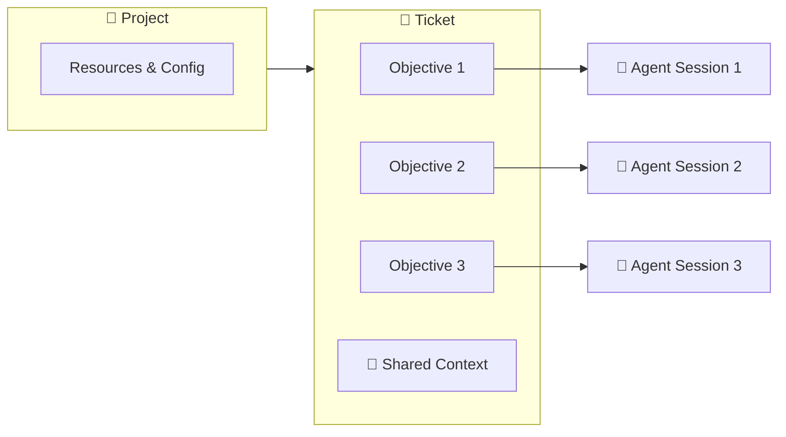
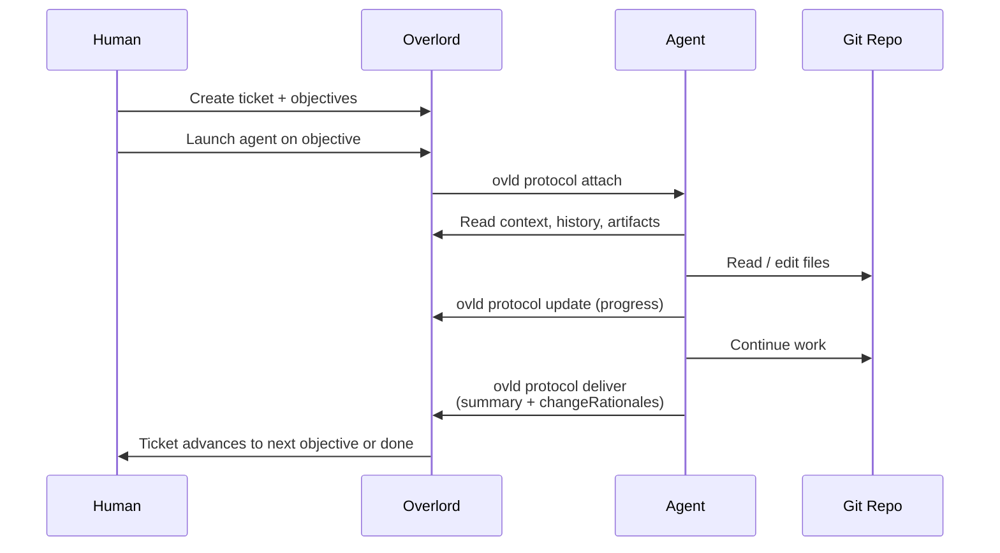

# Overlord

**A platform for managing AI agent workflows across tickets, projects, and devices.**

Watch demo videos and sign up for the beta at [ovld.ai](https://www.ovld.ai).

## Overview

Overlord is a coordination layer for AI coding agents (Claude Code, Codex, Cursor, OpenCode, Antigravity, and others). Instead of treating each agent session as a one-shot, throwaway interaction, Overlord persists work as **tickets** with structured **objectives**, accumulates **shared context** as work progresses, and routes execution to the right **device** for the job — your laptop, a remote workstation, or a cloud runner.

The result is a Kanban-style workflow where humans plan and agents execute, with every session producing artifacts, change rationales, and history that the next session inherits.

### What Problem Does This Solve?

| Challenge                                                    | Overlord Solution                                            |
|--------------------------------------------------------------|--------------------------------------------------------------|
| Users lose track of context between prompts                  | Structured Kanban workflow lets you thoroughly plan prompts and prompt sequences |
| Agent sessions lose context between runs                     | Tickets persist objectives, history, attachments, and shared state in Postgres |
| Hard to track what an agent actually changed and why         | Agents record `changeRationales` per file as part of the deliver step |
| Agent lock-in: hard to switch between different agents between each turn | Assign any agent you want to each objective.                 |
| Plans, tickets, and code drift apart                         | One ticket holds many ordered objectives sharing the same context and artifacts |


### Architecture

**Key relationship:** one **objective** maps to one **agent session**. A **ticket** is home to one or more objectives plus their shared context. Tickets live inside a **project**, and a project is mapped to a **git repository** (and optionally a working device).

## Core Concepts




### Project 📁

The top-level container. A project is mapped to a git repository and a local working directory. Projects route tickets to the correct codebase and define which devices and resources are available for execution.

### Ticket 🎫

A unit of work, identified like `1:1204` (`<org>:<sequence>`). A ticket represents a feature, bug, or goal that may take one or many steps to complete. Tickets hold the shared state that every objective beneath them can read and contribute to: history, attachments, artifacts, acceptance criteria, and recorded change rationales.

### Objective 🎯

A single step inside a ticket — one objective equals one agent prompt. Objectives have a lifecycle (`draft → submitted → executing → delivered`) and execute sequentially. If a feature needs planning, implementation, and docs, that is three objectives on one ticket, not three tickets.

### Agent Session 🤖

The live attachment between an agent (Claude Code, Codex, Cursor, etc.) and an objective. A session is created when an agent calls `ovld protocol attach`, persists updates while the work runs, and closes when the agent calls `deliver`. Sessions carry a `sessionKey` that authenticates subsequent protocol calls.

### Shared Context 📚

Everything attached to the ticket that survives across objectives: `write-context` entries, uploaded attachments, recorded artifacts, prior session history, and change rationales. The next agent session inherits all of it.

### Change Rationale 📝

A structured record per modified file describing **what** changed, **why**, and the **impact**. Agents emit these during `deliver`, producing an audit trail that lives alongside the diff and survives long after the session ends.

### Project Resource 🔌

A typed resource attached to a project — an SSH target, a working directory, a database, etc. Resources let a ticket say "run me against *this* environment" without hard-coding paths in the prompt.

### Connectors 🔗

Per-agent integrations that launch the right CLI with the right plugin, hooks, and permissions. Claude Code, Codex, Cursor, OpenCode, and Antigravity each have a connector that maps Overlord's protocol onto their native session model.

### Device 💻

A registered machine (laptop, remote workstation, cloud runner) that can execute tickets. Devices are fingerprinted and can be selected as execution targets, including over SSH for remote project resources.

### Protocol Surfaces 🛰️

The same protocol is exposed four ways:

- **HTTP API** — `/api/protocol/*` under `apps/web`
- **CLI** — `ovld protocol <subcommand>` from `packages/overlord-cli`
- **MCP server** — `mcp__claude_ai_Overlord__*` tools for in-agent calls
- **Agent plugins** — slash commands and skills installed into each agent

Drift between these surfaces is treated as a bug; the `drift-review` skill enforces parity.

## Repository Layout

```
apps/
  web/            Next.js app — UI, API routes, protocol HTTP surface
  desktop/        Electron wrapper around the web UI with native integrations
  mobile/         Expo / React Native client
  remote-agent/   Cloud runner for executing tickets off the user's machine
packages/
  overlord-cli/   The `ovld` CLI — protocol commands, attach/deliver, MCP shim
  shared/         Shared TypeScript types and schemas
supabase/         Migrations, RLS policies, seed data, edge functions
plugins/          Per-agent plugins (Claude Code, Codex, Cursor, OpenCode, …)
docs/             Design and integration docs
```

## Workflow



## Getting Started

### Prerequisites

- **Node.js 20+**
- **Yarn** (workspaces)
- **Supabase CLI** — `brew install supabase/tap/supabase`
- An agent CLI of your choice — Claude Code, Codex, Cursor, etc.

### Setup

```bash
git clone <this repo>
cd Overlord
yarn install

# Start local Supabase + generate types
yarn start
yarn generate
yarn seed:sync

# Launch the web app
yarn dev:web

# Or the desktop app
yarn dev:desktop
```

### Working A Ticket

```bash
# Attach an agent session to a ticket
ovld protocol attach --ticket-id 1:1204

# Post progress while working
ovld protocol update --ticket-id 1:1204 \
  --summary "Implemented step 1, moving to tests" --phase execute

# Deliver when done
ovld protocol deliver --ticket-id 1:1204 \
  --summary "..." --change-rationales-file rationales.json
```

For the full CLI reference, run `ovld protocol help`.

## Documentation

| Topic                                    | Document                                                                       |
| ---------------------------------------- | ------------------------------------------------------------------------------ |
| Agents & project conventions             | [CLAUDE.md](CLAUDE.md)                                                          |
| Checkpoints & change tracking            | [docs/checkpoints-change-tracking.md](docs/checkpoints-change-tracking.md)      |
| MCP auth & integration                   | [docs/MCP_AUTH_AND_INTEGRATION.md](docs/MCP_AUTH_AND_INTEGRATION.md)            |
| SSH key generation and management        | [docs/SSH_KEY_GENERATION_AND_MANAGEMENT.md](docs/SSH_KEY_GENERATION_AND_MANAGEMENT.md) |
| Changelog                                | [CHANGELOG.md](CHANGELOG.md)                                                    |

## License

Overlord is licensed under the [PolyForm Noncommercial License 1.0.0](LICENSE).

You may use, modify, and share the software for **any noncommercial purpose** — including personal use, research, education, and hobby projects. **Commercial use is not permitted** under this license. The software is provided **"as is", without warranty of any kind, and with no liability** to the extent allowed by law.

For commercial licensing inquiries, contact [Cooperativ Labs, Inc.](https://cooperativ.io).
