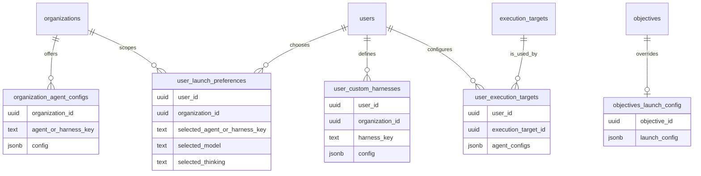
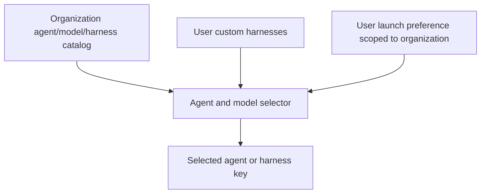
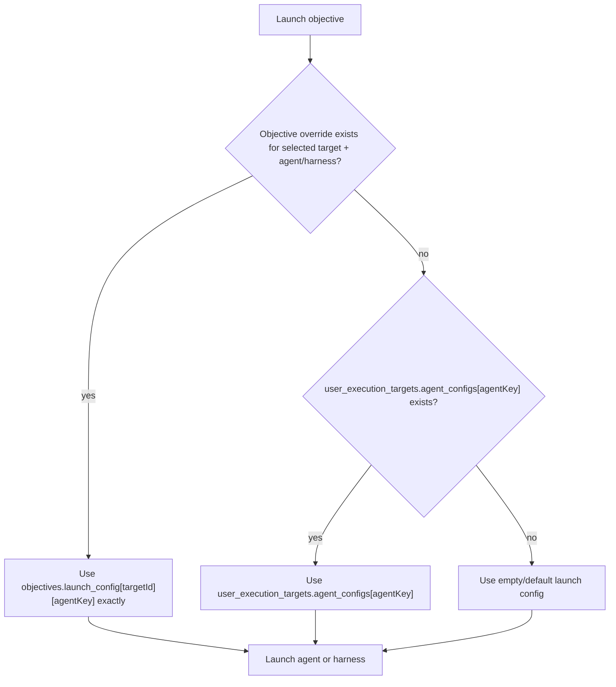
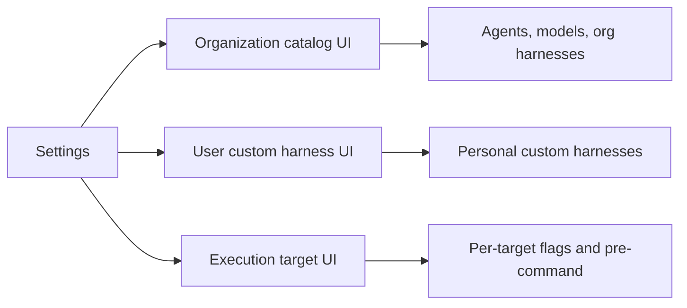

# Agent and Harness Configuration Architecture

## Decision

Agent and harness configuration should be split by ownership boundary instead of stored in one
user-level config table.

The canonical model is:

1. Organizations define which agents, models, and organization-provided harnesses are available.
2. Users may add their own personal custom harnesses in addition to the organization catalog.
3. Local launch commands are configured on `user_execution_targets`, because launch behavior is
   specific to a user on a specific execution target.
4. Per-objective launch changes are stored on `objectives.launch_config`, keyed by execution target
   and agent or harness key.

This means the existing `user_agent_configs` responsibility should be split. It should not remain
the canonical source for launch behavior.

## Ownership Boundaries

| Concern | Owner | Proposed storage | Notes |
| --- | --- | --- | --- |
| Built-in agents offered to employees | Organization | `organization_agent_configs` or equivalent | Controls the organization catalog. |
| Models offered for each built-in agent | Organization | `organization_agent_configs` or equivalent | Different organizations may expose different model sets. |
| Organization-provided custom harnesses | Organization | `organization_agent_configs` or `organization_harnesses` | Shared options for employees. |
| User-provided custom harnesses | User | `user_custom_harnesses` or equivalent | Personal additions on top of the organization catalog. |
| Last/default selected agent/model/thinking | User, scoped to org | `user_launch_preferences` | Preference only, not launch mechanics. |
| Local launch flags and pre-command | User + execution target | `user_execution_targets.agent_configs` | The user's local device is also an execution target. |
| Per-objective launch override | Objective + execution target + agent/harness | `objectives.launch_config` | Explicit override for one objective. |

## Data Model Diagram



## Catalog Resolution

The model selector should be built from the organization catalog plus the user's custom harnesses.



Organization catalog entries answer: "What is this employee allowed or expected to choose?"

User custom harness entries answer: "What extra personal harnesses has this user added?"

User launch preferences answer: "What does this user usually select in this organization?"

None of these should be the canonical place for local launch commands.

## Launch Configuration Resolution

Launch-time flags and pre-command should resolve from the most specific source first.



Important behavior:

- A present objective override is authoritative.
- Empty override values mean "run with no pre-command or flags" for that objective.
- If no override exists, inherit from `user_execution_targets.agent_configs`.
- If the target has no config for the selected agent or harness, use the empty default.

## Proposed JSON Shapes

### `user_execution_targets.agent_configs`

```json
{
  "claude": {
    "flags": ["--dangerously-skip-permissions"],
    "preCommand": "agent-pod"
  },
  "custom-harness-key": {
    "flags": ["--profile", "local"],
    "preCommand": "direnv exec ."
  }
}
```

### `objectives.launch_config`

```json
{
  "execution-target-id-a": {
    "claude": {
      "flags": [],
      "preCommand": ""
    }
  },
  "execution-target-id-b": {
    "custom-harness-key": {
      "flags": ["--debug"],
      "preCommand": "agent-pod"
    }
  }
}
```

The objective override is keyed by both execution target and agent or harness key so changing either
selection does not accidentally reuse a stale override from a different launch context.

## UI Implications

The settings UI should separate catalog selection from launch mechanics.



Recommended UI boundaries:

- Organization/admin surfaces configure offered agents, models, and organization-provided harnesses.
- User settings can expose personal custom harnesses.
- Execution target settings configure `agent_configs` for that user's relationship to that target.
- `AgentLaunchFooter` shows the launch config inherited from the selected execution target and saves
  edits as objective overrides.

The footer should always make the inherited source target clear. This avoids ambiguity when multiple
execution targets have different local launch behavior.

## Migration Direction

Recommended implementation sequence:

1. Rename `user_execution_targets.agent_flags` to `agent_configs`.
2. Keep `agent_configs` focused on local launch mechanics: `flags` and `preCommand`.
3. Change `objectives.launch_config` from one agent config blob to a target-keyed and agent-keyed
   override map.
4. Stop using launch fields from `user_agent_configs` as launch fallbacks.
5. Move organization-provided harness availability into an organization-scoped catalog table.
6. Move user-created custom harnesses into a dedicated user-scoped table.
7. Keep `user_launch_preferences` lightweight and scoped by organization.
8. Remove or retire `user_agent_configs` after its remaining responsibilities have been moved.

## Non-Goals

- Do not store local launch commands on `execution_targets`; the same target can be used by
  different users with different local preferences.
- Do not make organization catalog state responsible for launch flags or pre-commands.
- Do not let an objective override apply across agents or harnesses on the same target.
- Do not require a full app reload when the selected execution target changes; remounting or
  invalidating the affected selector/footer state is enough.
