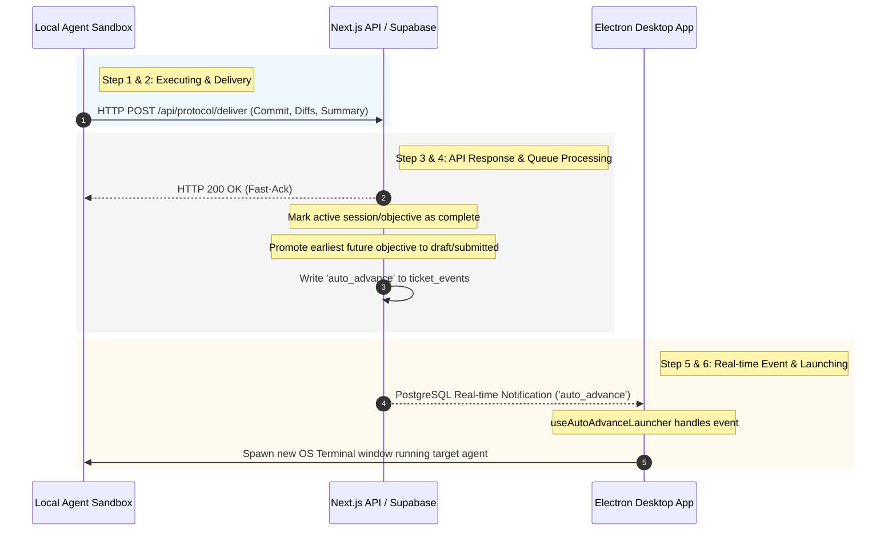

# Objective Auto-Advance Flow

This document details the step-by-step lifecycle of the **Objective Auto-Advance** feature. It explains how Overlord automatically promotes and launches sequential agent objectives, outlining where each step occurs and whether the desktop Electron application must be open.

---

## Technical Walkthrough

### 1. Running the First Objective
* **What is happening**: The first objective (e.g., *Objective A*) is in the `executing` state. The assigned agent (such as Claude Code, Cursor, Codex, or Gemini CLI) is running locally, working on the task.
* **Where the action is happening**: Locally on the user's computer inside a terminal process or sandbox environment.
* **Electron App Requirement**: **No.** Once the agent process is successfully launched, it executes independently in its own operating system process shell (tmux pane, terminal window, or sandbox). The Electron app does not need to be running.

### 2. The Agent Completes the Objective and Delivers Work
* **What is happening**: The agent completes the objective and invokes the protocol’s deliver tool. This tool sends an HTTP `POST` request containing git commits, file diffs, change rationales, and the completion summary to the Next.js API endpoint `/api/protocol/deliver`.
* **Where the action is happening**: The HTTP request is initiated by the local agent process and processed by the Next.js server (either hosted on Vercel or running locally).
* **Electron App Requirement**: **No.** The agent communicates directly with the Next.js backend/API over standard HTTP/HTTPS networks. The Electron app is not involved in handling or transmitting this network request.

### 3. Next.js Server Receives the Deliver Request
* **What is happening**: The POST handler in `apps/web/app/api/protocol/deliver/route.ts` runs. It:
  1. Validates the incoming payload against `deliverSchema`.
  2. Resolves the correct database records (`ticketId`, `sessionId`).
  3. Synchronously inserts a `deliver` ticket event into the `ticket_events` table on Supabase.
  4. Stores git commit snapshots, database checkpoints (`upsertObjectiveCheckpoint`), and file-change rationales (`insertFileChanges`).
  5. Returns a synchronous `200` response back to the agent so it can exit.
* **Where the action is happening**: Next.js server (App Router runtime) and the Supabase PostgreSQL database.
* **Electron App Requirement**: **No.** This is a standard web server handler processing a request and updating tables in Supabase.

### 4. Next.js Backend Evaluates the Queue (Deferred Processing)
* **What is happening**: Immediately after returning the fast-ack `200` response, the server executes a deferred background task (via Next.js `after()` callback):
  1. It marks the delivering objective as `complete` (setting `completed_at`) in the `objectives` table.
  2. It updates the agent session's `session_state` to `completed` and sets `detached_at` in the `agent_sessions` table. *This is done before the auto-advance event is emitted so that subsequent checks do not block the next launch.*
  3. It calls `scheduleQueuedObjectiveAfterDeliver(...)` from `lib/auto-advance/schedule-after-deliver.ts`.
  4. The scheduler resolves the next objective. If no `draft` objective has content, it promotes the earliest `future` objective to `draft` state in the database.
  5. It checks the next objective's `auto_advance` setting:
     * **If `auto_advance !== false` (Enabled)**:
       * The next objective is moved from `draft` to `submitted` state and stamped with `auto_advanced_at = new Date()`.
       * The *next* earliest future objective is promoted to `draft` state (keeping the queue populated for visual display).
       * It inserts an `auto_advance` event row into the `ticket_events` table on Supabase.
     * **If `auto_advance === false` (Disabled/Gated)**:
       * The ticket is updated with `has_unopened_waiting_response = true` and `is_read = false`.
       * An `awaiting_approval` event is inserted into the `ticket_events` table.
       * A push notification is sent to the user via `sendPushNotification`.
* **Where the action is happening**: Next.js server (background worker thread) and the Supabase database.
* **Electron App Requirement**: **No.** This step is fully contained in the backend server queue-resolver logic.

### 5. Real-time Event Received by Electron App
* **What is happening**:
  * Since an `auto_advance` event was inserted into `ticket_events` in Step 4, Supabase emits a PostgreSQL realtime notification.
  * In the web UI, the `AutoAdvanceLauncher` React component is mounted. Because it runs with `enabled: isElectron` (detecting the desktop shell context), it subscribes to the Supabase realtime channel (`postgres_changes` on the `ticket_events` table) using the `useAutoAdvanceLauncher` hook.
  * The hook receives the `INSERT` event payload of type `auto_advance`.
* **Where the action is happening**: Inside the running Electron application's renderer process (browser context).
* **Electron App Requirement**: **Yes, absolutely.** If the Electron app is closed, there is no active React application context to maintain the WebSocket connection, subscribe to the realtime event channel, or handle incoming messages.

### 6. Electron App Launches the Next Agent Process
* **What is happening**:
  * The `useAutoAdvanceLauncher` hook executes `handleAutoAdvanceEvent`.
  * It verifies that the ticket target is `'agent'`, the target objective is indeed in `submitted` state with `auto_advanced_at` set, and that no active agent sessions currently block the ticket.
  * It queries user configurations (`user_agent_configs`) to fetch agent flags and parameters (model, thinking configurations) and maps the local project working directory from settings.
  * It triggers `launchAgent(...)` via `useTerminal()`.
  * `launchAgent` calls out to the Electron main process via the IPC bridge (`window.electronAPI`), which spawns a new OS terminal window or tmux session running the resolved agent startup command in the resolved local project directory.
  * It displays a native desktop system notification: *"Auto-advanced: Launching the next objective in a new terminal."*
* **Where the action is happening**: Inside the Electron app (renderer and main processes) and the local operating system's shell environment.
* **Electron App Requirement**: **Yes, absolutely.** Electron main process APIs (`window.electronAPI`) are required to spawn the local OS shell processes, read desktop configurations, and access local project paths.

### 7. The New Agent Process Runs the Second Objective to Completion
* **What is happening**: The new terminal window/agent process boots up, synchronizes with the database, fetches the objective instructions (now in `submitted`/`executing` state), and begins executing the next task.
* **Where the action is happening**: Locally on your computer inside the newly spawned terminal/agent process.
* **Electron App Requirement**: **No.** Once the terminal process is successfully spawned by the Electron main process in Step 6, the agent shell runs independently. The Electron app can be closed or minimized without interrupting the running agent.

---

## Architectural Summary

| Step | Action | Location | Electron Open? |
| :--- | :--- | :--- | :--- |
| **1** | Agent executes objective | Local Sandbox / Terminal | **No** |
| **2** | Agent posts delivery payload | Local Process & Next.js Server | **No** |
| **3** | Server saves commits & events | Next.js API & Supabase DB | **No** |
| **4** | Server completes session & evaluates queue | Next.js API `after()` Worker | **No** |
| **5** | Realtime subscription triggers event | Electron Renderer (Web App) | **Yes** |
| **6** | IPC triggers external command shell | Electron Main & Host OS | **Yes** |
| **7** | New agent starts execution | Local Sandbox / Terminal | **No** |
