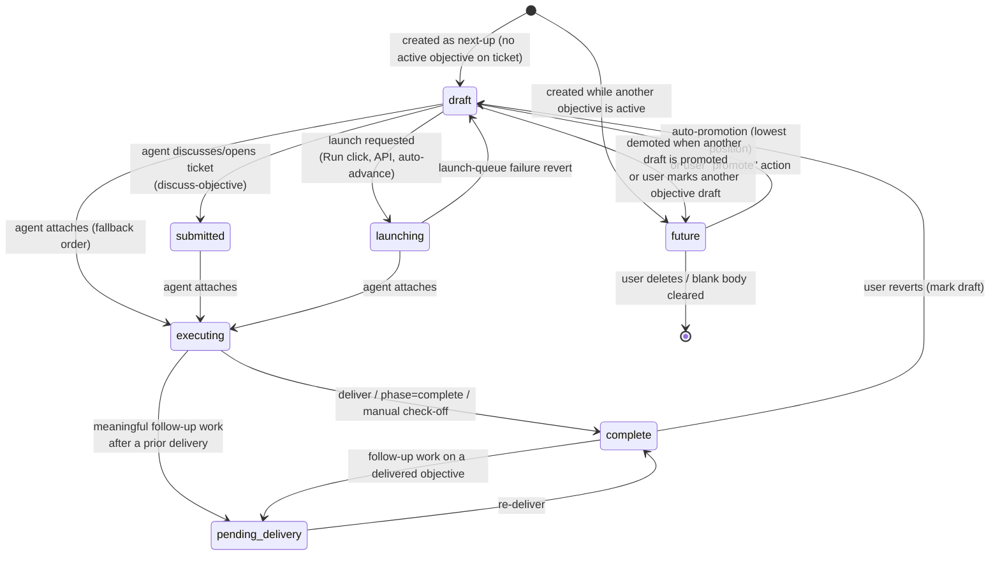

# Objective Lifecycle Automation

This document specifies how Overlord automates the lifecycle of **objectives**: which states exist, what triggers every state transition, and the invariants the system enforces at all times. It is written as a portable specification so the behavior can be replicated in other software.

A **ticket** represents a whole feature or goal. Each ticket owns an ordered queue of **objectives** — one objective equals one agent prompt/work session. Objectives advance through a state machine driven by user actions, agent protocol calls, and background automation.

Primary implementation references:

| Concern | Location |
| --- | --- |
| Core transition helpers | `lib/objectives.ts` |
| User-facing (UI) actions | `lib/actions/tickets/ticket-objectives.ts` |
| Attach protocol (→ executing) | `lib/overlord/protocol-attach.ts`, `supabase/functions/mcp/handlers/attach.ts` |
| Deliver protocol (→ complete) | `apps/web/app/api/protocol/deliver/route.ts`, `supabase/functions/mcp/handlers/deliver.ts` |
| Auto-advance scheduler | `lib/auto-advance/schedule-after-deliver.ts`, `supabase/functions/mcp/handlers/_auto-advance.ts` |
| Execution request queue | `lib/overlord/execution-requests.ts`, `apps/web/app/api/protocol/claim-execution/route.ts` |
| Follow-up redelivery | `lib/overlord/follow-up-delivery.ts` |
| DB constraints & triggers | `supabase/migrations/` (see [Database-enforced invariants](#database-enforced-invariants)) |

---

## 1. State catalog

`objectives.state` is a Postgres enum (`objective_state`) with seven values:

| State | Meaning | Objective text may be empty? |
| --- | --- | --- |
| `future` | Queued behind the current draft; not yet next in line. | Yes |
| `draft` | The single editable "next up" objective for the ticket. | Yes |
| `submitted` | Draft was surfaced to an agent for discussion (legacy "ready" state). The ticket is in active discussion but execution has not been ordered. | No |
| `launching` | A launch has been requested (an `execution_requests` row exists) but no agent has attached yet. Covers the whole pre-attach window. Treated like `submitted` by readers/UI. | No |
| `executing` | An agent session is attached and actively working the objective. | No |
| `pending_delivery` | Follow-up execution after a prior delivery produced new work that needs a re-delivery. | No |
| `complete` | Done. `completed_at` is set. | No |

Conceptually there are three groups:

- **Queue states** — `future`, `draft`: the editable backlog of upcoming work.
- **Active states** — `submitted`, `launching`, `executing`, `pending_delivery`: an objective somewhere between "handed to an agent" and "delivered".
- **Terminal state** — `complete` (re-enterable: completing is reversible via manual revert to draft, and `pending_delivery` can pull a completed objective back into the active set).

"**Launchable**" states (an execution request may be created or claimed for them): `draft`, `submitted`, `launching` (`EXECUTION_LAUNCHABLE_OBJECTIVE_STATES` in `lib/overlord/execution-requests.ts`).

"**Active**" states for queue-insertion purposes (used to decide whether a newly added objective becomes `draft` or `future`): `draft`, `submitted`, `launching`, `executing`, `pending_delivery`.

> Note: `objectives.state = 'launching'` and `execution_requests.status = 'launching'` are **different columns with different lifespans**. The objective state covers the whole request-created → attach window; the request status only covers the post-spawn/pre-attach window. See [Section 7](#7-companion-state-machine-execution-requests).

---

## 2. State diagram



---

## 3. Database-enforced invariants

These rules are enforced in Postgres (constraints, partial unique indexes, triggers), so they hold regardless of which code path writes. Any re-implementation should enforce equivalents transactionally.

1. **At most one `draft` per ticket.**
   `objectives_one_draft_per_ticket_idx` — unique partial index on `(ticket_id) WHERE state = 'draft'`.
   (`20260513143000_objective_state_enum.sql`)

2. **At most one `executing` *or* `pending_delivery` objective per ticket.**
   `objectives_one_executing_per_ticket_idx` — unique partial index on `(ticket_id) WHERE state IN ('executing','pending_delivery')`. Prevents auto-advance races from leaving two objectives active and prevents follow-up work awaiting redelivery from racing with another active objective.
   (`20260524100000_enforce_single_executing_objective.sql`, extended in `20260524120000_add_pending_delivery_objective_state.sql`)

3. **Unique per-ticket positions.**
   `objectives_ticket_position_unique_idx` — unique on `(ticket_id, position)`. Positions are integers starting at 0.
   (`20260521110000_enforce_unique_objective_positions.sql`)

4. **Auto-assigned position on insert.**
   A `BEFORE INSERT` trigger (`assign_objective_default_position`) fills `position = max(position)+1` for the ticket when the caller omits it. Callers doing manual reorders can set positions explicitly.
   (`20260518100000_auto_assign_objective_position.sql`)

5. **Non-empty text outside the queue states.**
   Check constraint `objectives_non_draft_requires_objective`: `state IN ('draft','future') OR length(trim(objective)) > 0`. An objective can never enter `submitted`/`launching`/`executing`/`pending_delivery`/`complete` with blank text.

6. **`completed_at` is managed by trigger.**
   `set_objective_completed_at` (`BEFORE UPDATE`): entering `complete` stamps `completed_at = now()` (if not provided); moving to any non-`complete` state clears it.

7. **At most one active agent session per objective.**
   `agent_sessions_one_active_per_objective_idx` — unique on `(objective_id) WHERE session_state IN ('attached','idle','blocked')`. A new attach must first detach any prior active session for the objective.

8. **At most one in-flight execution request per objective.**
   Partial unique index on `execution_requests(objective_id) WHERE status IN ('queued','claimed','launching')`. All launch paths reuse/re-queue an existing active request instead of inserting duplicates.

9. **`auto_advance` defaults to `false`.** Auto-advance is explicit opt-in per objective. (`20260520110000_objective_auto_advance_default_false.sql`)

---

## 4. Ordering rules and the position queue

- Every objective has an integer `position`, unique per ticket, 0-based. **Canonical sort order is `position ASC`, tie-broken by `created_at ASC`** (`sortObjectivesByPositionThenCreatedAt` in `lib/objectives.ts`). Every "pick the next objective" query in the system uses this order.
- **Appending** (protocol `create`, `add-objectives`, UI "add objective"): new rows take `max(position)+1` per insert order. The first inserted objective becomes `draft` only if the ticket has **no active objective** (`draft`/`submitted`/`launching`/`executing`/`pending_delivery`); otherwise it becomes `future`. All subsequent objectives in the batch become `future`. (`insertOrderedObjectives`)
- **User reorder via drag-and-drop** (`reorderFutureObjectivesAction`, UI in `apps/web/components/features/TicketObjectivesSection.tsx`):
  - Only the **`draft` + `future`** set can be reordered. IDs outside that set are silently dropped from the request.
  - The reordered queue **recycles the same sorted position pool** the set already occupied (`computeReorderedObjectivePositions`), so reordering the queue never collides with positions held by submitted/executing/complete objectives.
  - Persistence is two-phase to satisfy the unique index: all affected rows are first moved to temporary high positions (`max + count + 1000 + i`), then written to their final positions (`persistObjectivePositions`).
- **Promotion** (`promoteFutureObjectiveAction`): promoting a `future` objective to `draft` moves it to the current draft's slot in the ordering (`computePromotedObjectivePositions` splices it before the existing draft), demotes any existing `draft` to `future` first (preserving invariant #1), then persists positions.
- **Deletion**: only `future` objectives may be deleted outright (`deleteFutureObjectiveAction`). Clearing the body of a `future` objective via the editor also deletes it (`updateObjectiveBodyAction`). Positions are *not* compacted on delete; the unique index and relative order are sufficient.
- **Editing**: objective text is only editable in `draft`, `future`, `submitted`, and `launching`. `executing`/`pending_delivery`/`complete` text is immutable through the editing surfaces.

---

## 5. Transition reference

Every automated transition, its trigger, guard conditions, and side effects.

### 5.1 Creation

| Trigger | Resulting state | Notes |
| --- | --- | --- |
| Ticket created with objectives (protocol `create`, UI) | First objective `draft`, rest `future` | `prompt` additionally requests execution immediately. |
| `add-objectives` protocol call | First appended objective: `draft` if no active objective on the ticket, else `future`; rest `future` | `insertOrderedObjectives` with `firstStateWhenNoActive: 'draft'`, `firstStateWhenActive: 'future'`. |
| UI "add objective" (`createEmptyDraftObjectiveAction`) | `draft` if the ticket has none, else `future` | No-op if the last editable objective is already an empty draft. New row seeds `assigned_agent` from the most recently set agent on the ticket. |
| Automatic queue refill (see 5.4 / 5.6) | `draft` | Promote next `future`, or insert an **empty draft** when no `future` exists. |

### 5.2 `draft` → `submitted` — discussion intent

**Trigger:** an agent opens or discusses a ticket in chat without being ordered to execute (`ovld protocol discuss-objective`, REST `discuss-objective`, MCP `discuss-objective`). Calls `submitDraftObjective`.

- Guard: objective text must be non-empty (else error `Objective cannot be empty.`).
- Idempotent: if the objective is already `submitted` or `launching`, the call succeeds without changing state (`didSubmit: false`).
- Only `draft` objectives can be submitted; any other state returns "not in a submittable state".
- Signals "in active discussion with an agent, not yet executing". No session is created.

### 5.3 `draft` → `launching` — launch requested

**Trigger:** an execution request is created for the objective. Sources (`requested_from`): a user clicking **Run**, the public API, or **auto-advance after a delivery** (see 5.6). Implemented in `createExecutionRequest` and the MCP `_auto-advance.ts` mirror.

Sequence (all guarded so races cannot double-queue):

1. Resolve the target objective: the explicit `objectiveId`, or the **lowest-position launchable** (`draft`/`submitted`/`launching`) objective on the ticket. Reject if text is empty, the state is not launchable, or the ticket is marked `for_human`.
2. **Dedup:** if an active (`queued`/`claimed`/`launching`) execution request already exists for the objective, reuse it — a stale `claimed`/`launching` row is CAS-reset to `queued` and a fresh `execution_requested` event is emitted so runners wake up. No new row, no objective-state change beyond what already happened.
3. If the objective is `draft`, update it to `launching` (guarded `eq state = 'draft'`). Auto-advance also stamps `auto_advanced_at`. (A `submitted` objective stays `submitted`; `launching` stays `launching`.)
4. Insert the `execution_requests` row with `status: 'queued'` and an idempotency key (`auto_advance:<objective_id>` for auto-advance, random-suffixed otherwise). A unique-violation on insert is resolved by reusing the row that won the race.
5. Emit a `ticket_events` row of type `execution_requested` (this is what wakes Desktop/CLI runners).

**Failure revert:** if the request row cannot be created (insert error, unresolvable race), the objective is reverted `launching` → `draft` (guarded `eq state = 'launching'`) and `auto_advanced_at` is cleared (`revertLaunchingObjective`). This is the only automated backward transition out of `launching`.

### 5.4 `launching`/`submitted`/`draft` → `executing` — agent attaches

**Trigger:** an agent calls `attach` (REST `protocol/attach`, MCP `attach`, or `connect`/`spawn`, which share `markSubmittedObjectiveExecuting`).

1. **Selection order:** prefer the lowest-position objective in `launching`, then `submitted`, then `draft` (each ordered by `position ASC, created_at ASC`). The first non-empty match is the launch objective.
2. **Re-attach idempotency:** when no launchable objective exists but the ticket already has an `executing` or `pending_delivery` objective, attach returns that objective **without changing state**. This lets an agent that lost its session key recover by re-attaching.
3. Guard: an assigned agent must resolve from the objective (or attach metadata); attach fails otherwise.
4. Update the objective: `state = 'executing'`, stamp `agent_identifier` and `model_identifier`, clear `completed_at`.
5. **Queue refill — the ticket must always have a next editable slot:**
   - Promote the lowest-position `future` objective to `draft` (`promoteNextFutureDraft`), clearing its `completed_at`; or
   - if no `future` exists and no `draft` exists, insert a new **empty `draft`** seeded with the executing objective's `assigned_agent` (agent selection persists across objectives; it only changes by explicit user/agent action).
6. **Session bookkeeping:** detach any prior active session for the objective (satisfies invariant #7), insert the new `agent_sessions` row.
7. **Execution request settlement:** mark the matching request `launched` (prefer the request id threaded through attach metadata as `executionRequestId`; fall back to the objective's active request). Attach is the source of truth for a successful launch. Failures here never fail attach; manual launches with no request are a no-op.
8. **Ticket status:** set the ticket to the org's preferred `execute`-type status. If the previous status was `review`/`complete`-type, also emit a `ticket_reopened` event.
9. Fire-and-forget: generate an objective title (truncation for ≤100 chars; AI summarization above that, subject to the user's `ai_title_generation` preference).

### 5.5 `executing` (and others) → `complete` — delivery

**Trigger:** the agent calls `deliver` (REST/MCP). After persisting the delivery event, artifacts, checkpoint, and change rationales:

1. Update the session's objective to `complete` with `completed_at = now()`, guarded `IN ('executing','pending_delivery','submitted','launching','draft')` — deliver completes the objective from any active state, but never resurrects an already-complete row.
2. Mark the agent session `completed`/detached. (Ordered before auto-advance so launchers see no active session when the next `execution_requested` event arrives.)
3. Run the **auto-advance decision** (5.6).
4. If auto-advance did **not** queue anything: move the ticket to the org's preferred `review`-type status, placed at the **top** of that board column (`board_position = head - 1`), and emit a `status_change` event ("Ticket delivered and moved to review.").

Other paths to `complete`:

- **Agent marks the ticket complete:** a protocol `update` with a phase whose status type is `complete` marks all `executing`/`pending_delivery` objectives on the ticket `complete`.
- **Manual check-off** (`markObjectiveExecutedAction`, UI): sets any non-complete objective to `complete`. If it was still in the queue (`draft`/`submitted`/`launching`), the queue refill from 5.4 step 5 runs (promote next `future` or create an empty draft). Any active execution requests for the objective are failed/cancelled. Idempotent for already-complete objectives.

### 5.6 Auto-advance decision (runs inside deliver)

After completing the delivered objective, the system inspects the **lowest-position `draft`** on the ticket (`scheduleQueuedObjectiveAfterDeliver` / `scheduleAutoAdvanceAfterDeliver`):

```text
next_draft = lowest-position draft with non-empty text
if none                     → no advance → ticket goes to review
elif ticket.for_human       → no advance
elif draft.auto_advance     → (requires assigned agent)
                              draft → launching, insert queued execution_request,
                              emit execution_requested  → runner launches next agent
else (auto_advance = false) → emit blocking awaiting_approval event
                              (summary = objective.approval_reason or default),
                              flag ticket has_unopened_waiting_response,
                              notify the user; objective STAYS draft
```

Notes:

- An **empty** draft (the auto-created refill slot) never auto-advances — the queue simply ends and the ticket moves to review.
- The awaiting-approval branch counts as "advanced" for ticket-status purposes: the ticket does **not** move to review while an approval is pending.
- **Approval gating:** an agent can pre-gate a queued objective via `request-approval-gate` (sets `auto_advance = false` + `approval_reason`). A user approves via `clearAwaitingApprovalAction` (sets `auto_advance = true`, clears `approval_reason` and the ticket's waiting flag); the objective then launches on the next trigger (user Run, or it auto-advances after the next delivery). Toggling `auto_advance` is only allowed while the objective is in `draft`/`submitted`/`future`/`launching`; enabling it clears `approval_reason`.

### 5.7 → `pending_delivery` — follow-up work after a delivery

**Trigger:** after an objective has at least one `deliver` event, a subsequent protocol `update`/`record-change-rationales` call carrying a **meaningful follow-up work signal** transitions it to `pending_delivery` (`markObjectivePendingDeliveryAfterPriorDelivery`). Meaningful signals (`hasMeaningfulFollowUpWorkSignal`):

- any change rationales,
- a git commit id or diff stat in the snapshot,
- explicit `followUpIntent = 'pending_delivery'`,
- non-empty `artifacts`/`deliverables` in the payload,
- an `update` event with execution intent (`followUpIntent = 'execution'` or `phase = 'execute'`).

An explicit `beginFollowUpWork` flag is **not** itself a work signal (it merely announces intent). Guarded `IN ('executing','submitted','launching','draft','complete')` — note this is the one transition that can pull a `complete` objective back into the active set. Because of invariant #2, a ticket can hold only one `executing`-or-`pending_delivery` objective, so pending redelivery blocks a second active objective.

`pending_delivery` resolves only via a new `deliver` (→ `complete`, per 5.5). `checkDeliveryStatus` reports `needed: true` while an objective sits in this state, prompting agents to re-deliver.

### 5.8 Manual user overrides

| Action | Transition | Preserved invariants |
| --- | --- | --- |
| Mark draft (`markObjectiveDraftAction`) | any state → `draft`; `completed_at` cleared | All *other* drafts on the ticket are demoted to `future` first, so the one-draft index never trips. |
| Promote future (`promoteFutureObjectiveAction`) | `future` → `draft` (existing draft demoted to `future`); positions respliced | One draft per ticket; ordering. Idempotent if already draft; rejects non-`future` states. |
| Reorder (dnd) | no state change; positions recycled within the draft+future set | Position uniqueness via two-phase write. |
| Delete future | `future` row removed | Only `future` may be deleted. |
| Manual complete | see 5.5 | Queue refill + execution-request cancellation. |

---

## 6. The "always a next slot" guarantee

A central piece of the automation: **whenever an objective leaves the editable queue, the system immediately restores a `draft` slot** so the user/agent always has a "next objective" to type into:

- On **attach** (5.4 step 5),
- On **manual complete** of a queued objective (5.5),
- On follow-up draft creation when an agent files new work via protocol `create` with a session.

Refill order: promote the lowest-position `future`; otherwise insert an empty `draft` (seeded with the previous objective's `assigned_agent`). Combined with invariant #1, the steady-state shape of a ticket's queue is:

```text
[complete*] [one executing|pending_delivery?] [one draft] [future*]
            └────── at most one (DB) ──────┘  └ at most one (DB) ┘
```

---

## 7. Companion state machine: `execution_requests`

Launch automation is mediated by a durable queue. Request statuses: `queued` → `claimed` → `launching` → `launched`, with `failed` reachable from any active status.

| Transition | Trigger |
| --- | --- |
| → `queued` | Launch requested (5.3). At most one active request per objective (invariant #8); duplicates are reused/re-queued. |
| `queued` → `claimed` | A runner polls `claim-execution`. Compare-and-swap guarded on `status = 'queued'` with a lease (`lease_expires_at`), so concurrent polls cannot double-claim. Claim is refused/deferred when the target doesn't match, the working directory can't be resolved (missing primary directory → request stays queued with a recorded error), or agent config lookup fails (stays queued for retry). |
| `claimed` → `launching` | Runner reports a successful child spawn (`complete-execution-launch`). The spawn started; no agent has attached yet. Lease stays in place. |
| `claimed`/`launching`/`queued` → `launched` | The agent **attaches** (5.4 step 7). Attach is the source of truth for launch success; the lease is cleared. |
| active → `failed` | (a) runner reports a launch error (`fail-execution-launch`); (b) a `claimed`/`launching` row's lease expires before attach — the next poll fails it and notifies the user with a retryable alert instead of silently relaunching; (c) the user clears the queue (`clear-execution-requests`); (d) a poll finds the objective is no longer launchable (e.g. it was completed or reverted manually) and cancels the request. |

Mapping to objective state: the objective sits in `launching` for the entire `queued → launched` window. A failed request does **not** automatically revert the objective out of `launching` (except the immediate creation-failure revert in 5.3); `launching` remains a *launchable* state precisely so a Retry creates/reuses a request without state gymnastics.

---

## 8. Ticket status coupling

Objective transitions drive the ticket's kanban status (statuses are org-configurable but typed `draft` / `execute` / `review` / `complete`; transitions resolve the org's preferred status name per type):

| Objective event | Ticket effect |
| --- | --- |
| Agent attaches (→ `executing`) | Ticket → `execute`-type status. If it was in `review`/`complete`, a `ticket_reopened` event is emitted. |
| Deliver with nothing auto-advanced | Ticket → `review`-type status, top of the review column, marked unread. |
| Deliver with auto-advance queued | Ticket **stays** in execute; the next objective launches. |
| Deliver gated on approval | Ticket stays put; `has_unopened_waiting_response = true`, blocking `awaiting_approval` event. |
| Agent `update` with `phase` mapping to `complete`-type | All `executing`/`pending_delivery` objectives → `complete`. |

---

## 9. Secondary automation on transitions

- **`completed_at`** — trigger-managed (invariant #6); manual writes are tolerated but unnecessary.
- **Titles** — generated fire-and-forget when an objective starts executing (and on manual complete): plain truncation ≤100 chars, AI summarization above that (user-toggleable).
- **`assigned_agent` inheritance** — every auto-created draft (refill or UI add) copies the most recent `assigned_agent` so the chosen agent/model persists down the queue; it only changes via explicit user/agent action.
- **`auto_advanced_at`** — stamped when auto-advance moves a draft to `launching`; cleared on revert.
- **Events** — every meaningful transition writes a `ticket_events` row (`execution_requested`, `awaiting_approval`, `status_change`, `ticket_reopened`, `execution_launch_failed`, alerts, system notes), which power the realtime feed, notifications, and runner wake-ups.

---

## 10. Re-implementation checklist

To replicate this system, enforce — transactionally, not just in application code:

1. Per ticket: ≤1 `draft`; ≤1 objective in (`executing` | `pending_delivery`); unique integer positions.
2. Non-queue states require non-empty objective text.
3. Per objective: ≤1 active agent session; ≤1 in-flight execution request.
4. Canonical ordering everywhere: `position ASC, created_at ASC`; user reorders confined to the `draft`+`future` set, recycling that set's position pool.
5. State changes are CAS-guarded on the expected current state (`eq('state', …)` / `in('state', …)`) so concurrent triggers degrade to no-ops, never to duplicate transitions.
6. Discussion ≠ execution: opening a ticket submits the draft (`draft → submitted`); only an explicit execution order attaches (`→ executing`).
7. Whenever an objective leaves the queue, refill the `draft` slot (promote next `future`, else create an empty draft inheriting the agent assignment).
8. Auto-advance only on explicit opt-in (`auto_advance = true`), only with non-empty text and an assigned agent, never on `for_human` tickets; otherwise emit an approval gate instead of launching.
9. Delivery completes the objective *before* deciding what runs next; if nothing advances, surface the ticket for review.
10. Post-delivery work on a delivered objective re-opens it as `pending_delivery`, which blocks other active objectives until re-delivered.
