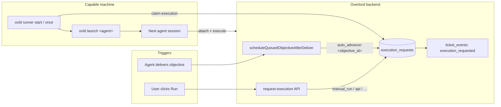

# Objective Auto-Advance Flow

Auto-advance and manual Run share one launch path: the backend decides **what** should run, writes a durable `execution_requests` row, and a capable machine runs **`ovld runner`** to claim that row and start the agent with **`ovld launch`**.

The backend coordinates execution; it does not spawn terminals. Electron is optional — a foreground CLI runner, a future always-on service, or a remote host runner can perform the launch.

## Architecture



## End-to-end sequence

```mermaid
sequenceDiagram
  autonumber
  participant Agent as Current agent
  participant API as Next.js API / Supabase
  participant Runner as ovld runner
  participant Next as Next agent

  Agent->>API: POST /api/protocol/deliver
  API->>API: Complete session; evaluate draft queue
  alt auto_advance = true
    API->>API: draft → submitted; insert execution_requests
    API->>API: execution_requested event
  else auto_advance = false
    API->>API: awaiting_approval event + notify user
  end
  Runner->>API: POST /api/protocol/claim-execution
  API-->>Runner: Claimed launch params (agent, model, path, SSH)
  Runner->>Next: ovld launch &lt;agent&gt; --ticket-id …
  Runner->>API: POST /api/protocol/complete-execution-launch
  Next->>API: POST /api/protocol/attach
```

## Auto-advance steps

1. The current agent calls `POST /api/protocol/deliver`.
2. Deferred deliver work completes the active session, then runs `scheduleQueuedObjectiveAfterDeliver(...)`.
3. If there is no draft objective with non-empty content, auto-advance stops.
4. If the draft has `auto_advance = false`, Overlord writes an `awaiting_approval` event and notifies the user. No execution request is created.
5. If `auto_advance = true`, Overlord creates an execution request with idempotency key `auto_advance:<objective_id>`. That path moves the objective to `submitted`, sets `auto_advanced_at`, and emits `execution_requested`.
6. `ovld runner start` (or `ovld runner once`) registers the device, claims a compatible queued request, resolves a project resource directory or SSH launch params from `launch_params`, and runs `ovld launch`.
7. The next agent attaches and executes the submitted objective.

## Manual Run

Manual Run uses the same queue:

- UI: `requestTicketObjectiveExecutionAction(...)` → `POST /api/protocol/request-execution`
- CLI/MCP: `ovld protocol request-execution` / `request_execution`

Idempotency keys differ from auto-advance so repeated manual launches are allowed (`manual_run:<objective_id>:<client-request-id>`). Assigned agent, model, thinking, flags, and working directory come from the objective (with user defaults only when appropriate).

| Environment | What happens |
| --- | --- |
| Runner active locally | Request is claimed and launched automatically |
| Browser only, no runner | Request stays queued; UI can show “waiting for runner” and a copyable `ovld launch` command |
| Remote target | A runner on that host (or SSH launch params on a local runner) claims and executes |

## Execution request lifecycle

| Status | Meaning |
| --- | --- |
| `queued` | Waiting for a runner that can satisfy target device/resource/kind |
| `claimed` | Leased by a device; runner is about to launch |
| `launching` | Launch in progress |
| `launched` | Child process started; `launched_session_id` set when known |
| `failed` | Launch error recorded in `last_error` |
| `failed` | Launch failed or the queue row was cleared manually |

Duplicate auto-advance for the same objective is prevented by the unique `(organization_id, idempotency_key)` constraint. Stale claims can expire via `lease_expires_at` and be retried.

## Runner commands

```bash
ovld runner once    # Claim and launch one queued request, then exit
ovld runner start   # Poll (or Realtime) and claim continuously
ovld runner status  # Inspect local runner identity and visible queue
ovld runner clear <objective_id>  # Clear one active queue row
ovld runner clear-all  # Clear every active queue row visible to the caller
```

Protocol operations used by the runner:

| Operation | API | CLI |
| --- | --- | --- |
| Enqueue | `POST /api/protocol/request-execution` | `ovld protocol request-execution` |
| Claim | `POST /api/protocol/claim-execution` | `ovld protocol claim-execution` |
| List | `POST /api/protocol/list-execution-requests` | `ovld protocol list-execution-requests` |
| Clear | `POST /api/protocol/clear-execution-requests` | `ovld protocol clear-execution-requests` |
| Success | `POST /api/protocol/complete-execution-launch` | `ovld protocol complete-execution-launch` |
| Failure | `POST /api/protocol/fail-execution-launch` | `ovld protocol fail-execution-launch` |

## What must be running

| Step | Needs Electron? | Needs runner? |
| --- | --- | --- |
| Agent delivers | No | No |
| Server enqueues next objective | No | No |
| Terminal/agent starts | No | Yes — on some machine that can run `ovld launch` |
| Next agent executes | No | No (agent process only) |

For CLI-only or closed-desktop workflows, run `ovld runner start` on the workstation (or on a remote host registered as a device with project resources). Auto-advance then proceeds without the Overlord desktop app open.

## Related docs

- Feature plan: `ai/feature-plans/auto-advance-terminal-runner.md`
- Connector surfaces: `ai/guidence/CONNECTOR_SURFACES.md`
