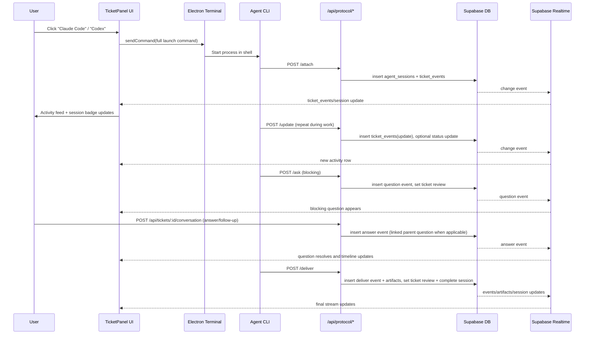

# Terminal Task Submission and Per-Ticket Streaming

## Scope

This document explains two related but distinct flows in this codebase:

1. How a ticket task is launched into a terminal.
2. How agent progress/results are streamed back into the corresponding ticket UI.

The key design detail is that terminal output streaming and ticket activity streaming are separate systems.

## High-Level Architecture

```mermaid
flowchart LR
  A["Ticket panel UI"] --> B["LaunchCommandBar / CopyTicketPromptButton"]
  B --> C["TerminalProvider.sendCommand"]
  C --> D["Electron IPC (terminal:spawn/write/open-external)"]
  D --> E["node-pty shell (embedded) OR OS terminal app (external)"]

  E --> F["Agent process (claude/codex)"]
  F --> G["/api/protocol/* routes"]
  G --> H["Supabase tables: ticket_events, artifacts, agent_sessions"]
  H --> I["Supabase Realtime channel ticket-realtime:<ticketId>"]
  I --> J["useTicketRealtime hook"]
  J --> K["TicketPanelLive Activity/Artifacts/Session badge"]
```

## Part 1: How Tasks Are Submitted to Terminal

### 1) Commands are constructed from ticket context

`TicketPanelContent` builds launch commands that inject:

- `PLATFORM_URL`
- `AGENT_TOKEN`
- `TICKET_ID`
- A `curl` call to fetch `/api/protocol/context/<ticketId>` and pass it to agent CLI.
- Optional project `local_working_directory` (configured in project settings) is passed as terminal `cwd`.

Code: `components/features/TicketPanelContent.tsx`

### 2) User triggers command execution

`LaunchCommandBar` buttons call `sendCommand(command)` from `useTerminal()`.

Code: `components/features/LaunchCommandBar.tsx`

### 3) Terminal mode decides execution path

`TerminalProvider.sendCommand()` behavior:

- `external` mode: `api.terminal.openExternal(command)`
- `embedded` mode:
  - if terminal exists: write `command + '\r'`
  - else: spawn a new PTY with the command

Code: `components/features/terminal/TerminalProvider.tsx`

### 4) Electron bridge and PTY execution

- Renderer calls API exposed in preload (`window.electronAPI.terminal.*`).
- IPC handlers route calls to terminal manager.
- Embedded terminal uses `node-pty` to spawn shell and forward output/exit events back to renderer.

Code:

- `electron/preload.ts`
- `electron/ipc/terminal.ts`
- `electron/services/terminal-manager.ts`
- `components/features/terminal/EmbeddedTerminal.tsx`

### 5) Embedded output stream is local UI only

In embedded mode:

- PTY data is emitted via `terminal:data`.
- `EmbeddedTerminal` writes bytes to xterm instance in-app.

In external mode:

- The app asks Terminal/iTerm/Warp to execute command.
- If a project working directory is set, command execution is prefixed with `cd <project_dir> && ...`.
- Output is not piped back into app UI.

Code: `electron/ipc/terminal.ts`, `components/features/terminal/EmbeddedTerminal.tsx`

## Part 2: How Information Streams Back to Each Ticket

### 1) Agent gets protocol instructions from context endpoint

`GET /api/protocol/context/[ticketId]` returns plaintext instructions generated by `buildTicketPromptMarkdown()`.
Instructions tell agent to call:

- `attach` (first)
- `update` (progress)
- `ask` (blocking question)
- `read-context` / `write-context`
- `deliver` (final)

Code:

- `app/api/protocol/context/[ticketId]/route.ts`
- `lib/overlord/ticket-prompt.ts`

### 2) Protocol routes persist ticket-scoped events

All protocol routes:

- Require bearer auth via `ensureAgentToken()`
- Validate JSON payloads with Zod
- Use service-role Supabase client for DB writes

Code:

- `app/api/protocol/_lib.ts`
- `lib/overlord/protocol-auth.ts`
- `lib/overlord/validation.ts`
- `supabase/utils/service-role.ts`

Primary write behavior:

- `attach`: inserts `agent_sessions` + `ticket_events(system)`, returns history/state
- `update`: inserts `ticket_events(update)`; optionally updates `tickets.status`
- `ask`: inserts blocking `ticket_events(question)`; updates status to `review` (or provided phase)
- `write-context`: inserts `shared_state` + `ticket_events(context_write)`
- `read-context`: reads `shared_state` + logs `ticket_events(context_read)`
- `deliver`: inserts `ticket_events(deliver)`, inserts `artifacts`, sets `tickets.status='review'`, marks session `completed`

Code:

- `app/api/protocol/attach/route.ts`
- `app/api/protocol/update/route.ts`
- `app/api/protocol/ask/route.ts`
- `app/api/protocol/read-context/route.ts`
- `app/api/protocol/write-context/route.ts`
- `app/api/protocol/deliver/route.ts`
- `lib/overlord/protocol-db.ts`

### 2.5) User answers/follow-ups are ticket events too

From the ticket UI, user responses are written through:

- `POST /api/tickets/[ticketId]/conversation`

This route stores:

- `entryType=answer` with `payload.parent_event_id=<questionId>` to resolve blocking questions
- `entryType=follow_up` for additional prompts

`answer` entries are persisted as `ticket_events(event_type='answer')`.
`follow_up` entries are persisted as `ticket_events(event_type='update')`.
Both include `payload.entry_type` and are streamed in realtime.

Code:

- `app/api/tickets/[ticketId]/conversation/route.ts`
- `components/features/TicketConversationComposer.tsx`
- `lib/overlord/conversation.ts`

### 3) Realtime fan-out is ticket-filtered

`useTicketRealtime` subscribes to Supabase Realtime channel `ticket-realtime:<ticketId>` and listens for:

- `INSERT` on `ticket_events` filtered by `ticket_id=eq.<ticketId>`
- `INSERT` on `artifacts` filtered by `ticket_id=eq.<ticketId>`
- `INSERT` and `UPDATE` on `agent_sessions` filtered by `ticket_id=eq.<ticketId>`
- `INSERT` on `shared_state` filtered by `ticket_id=eq.<ticketId>`

New rows are prepended into local UI state and rendered by `TicketPanelLive`.

Code:

- `lib/hooks/use-ticket-realtime.ts`
- `components/features/TicketPanelLive.tsx`

### 4) Realtime publication must include the tables

Realtime is enabled by migration:

- `agent_sessions`
- `ticket_events`
- `artifacts`

Code: `supabase/migrations/20260220000000_enable_realtime.sql`

## Data Model Used by Streaming

Core tables from initial migration:

- `agent_sessions` (session identity, state, heartbeat, attach/detach timestamps)
- `ticket_events` (event type, phase, summary, payload, blocking flag)
- `artifacts` (structured delivery outputs linked to event/session/ticket)
- `shared_state` (persisted key/value context across sessions)

Code: `supabase/migrations/20260214125337_init-squash.sql`

## End-to-End Runtime Sequence

## Important Clarifications

- Terminal stdout/stderr is **not** automatically written to ticket events.
- Ticket stream depends on the agent process explicitly calling protocol endpoints.
- Embedded terminal stream and ticket activity stream are independent:
  - Embedded stream: PTY bytes over Electron IPC.
  - Ticket stream: DB row inserts/updates over Supabase Realtime.
- Blocking questions are resolved by writing answer events with `payload.parent_event_id=<questionId>`.

## Operational Notes

- Auth for protocol routes uses a single bearer token (`OVERLORD_AGENT_TOKEN`, fallback local token in `lib/env.ts`).
- Protocol routes intentionally use service-role DB client; route auth is the security gate.
- Current SQL policies in the initial local migration include permissive local policies for several protocol tables; this is convenient for local dev, but production hardening should verify least-privilege policy posture.
