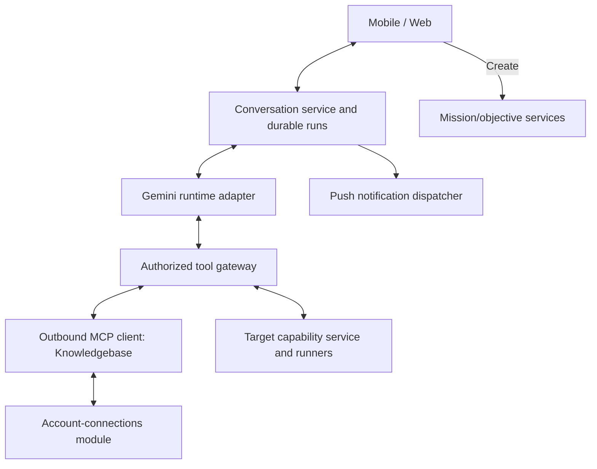

# Overlord assistant: mobile research and draft work (coo:1108)

Status: milestone one implemented; live acceptance run complete with three checks
blocked on a deploy and a person (see the
[acceptance report](chat-agent-request-routing-acceptance.md)).
Updated: 2026-10-04.

Incorporates the accepted refinements from the
[2026-10-04 architecture review](chat-agent-request-routing-review-2026-10-04.md):
conversation notifications, durable Gemini checkpoints, source-dependency
authorization, acknowledged-event push suppression, and frozen assignments.
Refined by the [Phase A findings](chat-agent-request-routing-phase-a-findings.md)
(coo:1108.cag9): checkpoint invariants, Knowledgebase client registration and phone
flow, and the missing hosted read route.

## 1. First milestone

A persistent assistant that gathers context, discusses ideas, and prepares work in
Overlord. Milestone one runs on Overlord Cloud with Gemini 3.8 Flash as the engine.

The milestone proves this journey:

1. On a phone, ask: “What would adding offline support require across Overlord and
   OverlordMobile? Check our notes and what is currently being changed.”
2. The assistant searches authorized Knowledgebase content and Overlord history, and
   inspects the relevant registered repositories on their execution targets.
3. It answers with source references and observation times, separates evidence from
   assumptions, and asks any necessary clarifying question.
4. The user discusses alternatives. Discussion creates no work.
5. The user asks for drafts. The assistant prepares a proposal card with explicit
   projects, objectives, and resource and agent assignments.
6. The user taps Create. All drafts are created together or none are.
7. The user opens the drafts in existing mission surfaces. Nothing launches.

It must work with the desktop app closed and the phone backgrounded, with a push
notification when the assistant finishes or needs an answer, and without lost work
or duplicates on reopening. An offline execution target cannot supply fresh state.

## 2. Scope

### Included

- Private, persistent conversations on mobile and the shared web app.
- Durable turns independent of the client connection.
- Gemini 3.8 Flash in the backend with a streaming tool loop.
- A shared account-connections module, with Knowledgebase as its first user.
- Knowledgebase as an outbound MCP connection, read tools only.
- Overlord project, resource, mission, objective, and delivery reads.
- Read-only repository inspection on permitted execution targets.
- Clarifying questions, source-aware answers, and proposals.
- Draft creation through a Create action in the client, across several projects.
- A shared event-stream client in the mobile core.
- Push notifications for “needs an answer” and “finished”.
- Generated thread titles with rename, and archive.

### Not included

- Codex, an agent host, the Local edition, and provider fallback (section 15).
- Creation, modification, or launch of work by the assistant itself.
- CLI inspection commands, thread deletion, and a third-party processing notice.
- Repository writes, shell execution, branch or worktree changes, and MCP writes.
- Queue management, automatic execution, and cross-project dependency scheduling.
- Proactive or scheduled research, subagents, voice, attachments, shared threads.
- Jev or any separate routing classifier.
- Visual design. A minimal functional client is enough for this milestone.
- Hosted-MCP exposure of local filesystem reads.

Related work that runs after this plan: coo:1109 (mobile live mission updates through
the shared stream client) and coo:1110 (Everhour and GitHub onto the shared
connections module).

## 3. Existing foundations

| Foundation | State in the code | Use |
| --- | --- | --- |
| Mission creation | One service function for every surface; one mission per call in its own transaction | Reuse through a wrapper (section 9.3) |
| Project discovery and search v3 | Shipped | Reuse for context reads |
| `observeResource`, `readRepositoryTree`, `listBranches`, `listWorktrees` | Implemented on the runner; inputs are backend-resolved absolute paths; no hosted route invokes them (the hosted repository endpoint returns `unsupported_resource`) | Reuse behind a new mission-less read route and gateway that resolve from resource identity |
| `readCurrentDiff` | Replaced (zg8m) by the resource-addressed diff; shares `currentDiffArgs` with the commit-message drafter | Repository diff reads |
| Git status | Structured `readGitStatus` (zg8m); the bare `git status --short` helper remains for its existing callers | Repository status reads |
| Runner queue | Carries mission-less capability calls; 30 second read timeout; operation ID is the idempotency key; claim resolves a null resource key to the primary resource | Transport for repository reads; pass the intended resource through to the claim |
| Gemini | One-shot calls for titles and delivery composition | Extend with streaming and tool calls |
| Secret storage | AES-256-GCM envelopes bound to the owner, duplicated in the Everhour and GitHub extensions | Extract into the connections module |
| Push notifications | Device registration and preferences reusable; history, jobs, recipients, and presentation are mission/workspace-addressed | Add conversation subjects and owner-addressed dispatch, plus two types |
| Realtime | Web has an event-stream client; mobile has none | Build the mobile client |

Chat inference runs do not use the worker job queue or Agent Session Exchange
tables. The latter remain specific to coding-agent sessions. Notification delivery
reuses the existing notification infrastructure; its job addressing must support
organization-scoped conversation owners without an arbitrary workspace or mission.

## 4. Architecture



| Boundary | Owner and responsibility |
| --- | --- |
| Conversation service | Core; conversation access, turn state, questions, proposals, receipts |
| HTTP and events | Backend; durable commands, replayable private event stream, run scheduling |
| Runtime adapter | `backend/chat/`; maps Gemini events and tool calls to normalized operations |
| Tool gateway | Core policy with injected adapters; validates and records every call |
| Account connections | One module for external sign-in, token storage, encryption, refresh, disconnect |
| Outbound MCP client | Backend; discovery and bounded read invocation |
| Repository reads | Local-target capability interface; the runner executes on the target |
| Domain writes | Existing mission services, reached only by the client Create action |
| Clients | Render state, send messages, answer questions, create from proposals, resume streams |

The control plane stores state, runs the engine, and authorizes tools. An execution
target owns a checkout and answers inspection calls. No working directory is an
implicit scope.

Chat is Cloud only. In the Local edition the clients show it as unavailable. All new
tables and services are still tested on SQLite and Postgres.

Chat is separate from the title and delivery automations; a chat failure is a typed
result, never a silent `null`.

## 5. Durable turns

### 5.1 State and adapter

Overlord owns messages, evidence, tool receipts, questions, summaries, proposals,
and draft links. Nothing depends on provider-side storage.

```ts
interface ChatRuntime {
  readiness(): Promise<RuntimeReadiness>;
  run(input: TurnInput, tools: AuthorizedToolInvoker): AsyncIterable<RuntimeEvent>;
  cancel(attemptId: string): Promise<CancelResult>;
}
```

Events cover text, tool invocation, question, proposal, completion, and typed
failure. The conversation service owns lifecycle and policy.

The adapter also owns a versioned durable provider checkpoint, separate from
rendered messages and public events. It preserves the original provider response
parts, opaque thought signatures, call IDs, and tool-result ordering required to
continue a Gemini tool loop. It is private server state, never a client DTO or log
payload, and carries the same source dependencies as the context it contains.
`TurnInput` identifies the authorized checkpoint to restore; checkpoint persistence
is injected through the service boundary and enforces the active attempt fence.

### 5.2 Runs and attempts

Run states: `queued`, `running`, `waiting_user`, `completed`, `failed`, `cancelled`.
A thread has at most one unfinished run; a run has at most one active attempt.

- While a run is `queued` or `running`, a new message returns a conflict. The user
  can cancel.
- While a run is `waiting_user`, any message is the answer and resumes that run.
  Tapping an option and typing free text are the same action.

Run state lives in the chat tables. Backend workers claim an attempt with a renewable
lease and a fencing token. Every event and tool call carries the owner, run, attempt,
and fence, so a worker that lost its lease is rejected. A question checkpoints the
attempt and releases the lease. Cancellation is authoritative at the gateway.

Questions use a shape the existing question and choice cards can display.

### 5.3 Client independence

Submitting a message persists the message and run atomically and returns their IDs.
A repeated client request ID returns the original run. Progress arrives on a separate
event stream. Events are ordered and persisted, with text deltas coalesced. A client
resumes after its last sequence; if that sequence is no longer retained, the server
returns `snapshot_required`. Clients never infer completion from a closed stream.

**Mobile stream client.** Build it in `OverlordCore` as a general component that owns
the connection, parsing, reconnect with backoff, and the resume cursor. Chat is its
first consumer. The snapshot endpoint must also support polling as a fallback.

**Push notifications.** Two new types in the existing catalog:

- **Needs an answer:** the run moved to `waiting_user`.
- **Finished:** the run completed or failed.

Extend notification subjects to include a conversation alongside mission/objective
subjects. A conversation notification names its owner profile, organization, thread,
run, and question revision when applicable. Extend durable history, unread counts,
job addressing, presentation, and mobile deep links accordingly. It never requires
a fabricated mission or an arbitrary workspace. Device registration, APNs transport,
and per-type alert, silent, and off preferences are reused.

Every qualifying state transition writes a durable notification candidate in the
same transaction as the transition. Delivery waits a short configurable grace
period (initially five seconds). Suppression requires an acknowledgement of the
specific event from a foreground client displaying that thread; an open socket
alone is insufficient. Foreground presence has a renewable expiry (initially thirty
seconds), and clients release it when backgrounding or leaving the thread. An
acknowledgement from any currently foreground device may suppress the candidate.
Otherwise the candidate is dispatched after the grace period, including when a
dead connection still appears open on the server.

Deduplicate by owner, thread, run, notification type, and question revision or
terminal transition. A new question must not collapse into an earlier question's
notification. Before dispatch, recheck ownership/access, preferences, and whether
the question remains unanswered. Delivery acknowledgement is distinct from a
transport resume cursor and does not change existing notification read semantics.
Name the thread with a bounded sanitized title; do not quote answers, questions,
or repository content. Tapping opens the correct thread, including on cold start.

### 5.4 Failure and recovery

Typed failures: `provider_unavailable`, `rate_limited`, `context_limit`,
`unsupported_capability`, `interrupted`, `provider_error`. Tool failures are separate.

A complete provider tool request is checkpointed before its tool executes; the
result is durably recorded and joined to that checkpoint before the next provider
request. Stream fragments are assembled into complete provider parts before a
tool is invoked. Lease loss rejects checkpoint writes as well as events and calls.

A failed attempt is fenced and its tool receipts reconciled. After reauthorizing
source dependencies, recovery resumes a valid provider checkpoint. If the checkpoint
cannot be resumed, the adapter explicitly starts a fresh generation from authorized
messages, decisions, and recorded observations, marks partial text interrupted,
and records that recovery mode. It never reconstructs a partial Gemini function-call
turn without the required signatures or blindly repeats an unresolved operation.
The run fails visibly when neither recovery path is safe.

Phase A evidence (live, `gemini-3.8-flash`):

- The provider validates thought signatures only on the current turn's function-call
  parts; a missing one returns HTTP 400. Completed exchanges may be resent without
  signatures, so a checkpoint is needed only while a tool turn is in flight, and
  completed turns can be rebuilt from stored messages and observations.
- The provider accepts reordered results, results without call IDs, and a parallel
  batch missing a result. Overlord enforces completeness, call order, and call-ID
  matching before every provider request; the provider does not.
- Parallel calls arrive in one turn; only the first function-call part carries a
  signature. Parts are stored verbatim and unmerged, including empty text parts.
- An operation whose receipt is `requested` when the worker dies is a read in this
  milestone and is re-executed under its original operation ID (the runner queue
  deduplicates by that key). A future write must be reconciled, never retried blindly.
- A checkpoint is reusable only when its schema version, model, and generation-config
  digest match; otherwise recovery is an explicit fresh generation.

## 6. Engine

Gemini 3.8 Flash (`gemini-3.8-flash`) through the deployment's Gemini API configuration,
with streaming and tool calls. Use the existing SDK's Generate Content API family
with locally persisted history for milestone one: `models.generateContentStream`
with `tools: [{ functionDeclarations }]` on `@google/genai` 2.8.0. Phase A proved
streaming sequential and parallel calls and restart at each boundary live. Do not introduce a dependency on provider-hosted conversation
storage. Any change of API after that proof must preserve the checkpoint and
recovery guarantees in section 5. Chat has its own model setting. Inference is paid
by the deployment operator. Gathered content, including notes, files, and diffs,
is sent to Gemini.

## 7. Tools

### 7.1 Gateway

Every call resolves the owner and live workspace and project permissions. The engine
reaches tools through an in-process invoker bound to the run, attempt, and fence.
The gateway validates schemas, scope, output limits, and timeouts, and records
provenance. Tool descriptions and content are untrusted and cannot expand permissions.

The tool list holds reads, questions, and “prepare or revise a proposal”. It holds no
tool that creates, changes, or launches work.

### 7.2 Overlord reads

Discovery and search return accessible projects, resources, missions, objectives,
and deliveries. Retrieve summaries first and expand what is relevant. Every proposal
names projects by stable ID; similar names are a reason to ask. A conversation is
scoped to one organization and may reference any of its workspaces the owner can
access.

### 7.3 Account connections and Knowledgebase

The connections module is the single place, in code and in the product, for external
account connections: sign-in, reauthorization, encrypted token storage, refresh (one
at a time per connection), readiness, and disconnect. It uses AES-256-GCM envelopes
bound to the owner, with the key from server configuration. Clients have one
connected-accounts surface. Credentials never appear in DTOs, logs, realtime, or
change projections.

The Knowledgebase connection is profile-owned within the organization and records
the server, authorized workspaces, tool-policy version, and readiness. It is
configured and reauthorized from mobile. The outbound MCP client exposes only a
reviewed read allowlist, rejects writes regardless of annotations, namespaces tool
IDs per connection, and bounds outputs. Only the configured Knowledgebase endpoint
is supported, with approved HTTPS origins and egress rules enforced server-side.

Knowledgebase authorization (Phase A): authorization code with PKCE S256 and the RFC
8707 `resource` parameter; no device grant and no dynamic registration. Overlord
registers through a Client ID Metadata Document published at a public Overlord HTTPS
URL (at most 5 KB, no redirects, `token_endpoint_auth_method` `none` or
`private_key_jwt`) whose redirect URI is a backend HTTPS callback. The backend creates
PKCE and state bound to owner, organization, and expiry and exchanges the code. The
phone opens the backend-issued authorize URL in `ASWebAuthenticationSession` and
returns through a universal link carrying only a status. Request `offline_access`.
Refresh tokens rotate on every use and replay after 30 seconds wipes every token for
the client and user, so refresh is serialized and the rotated token persisted before
use. Revoking the connection in the Knowledgebase takes effect on the next call;
revoking only a refresh token leaves the current access token valid for up to an
hour. The per-source access check is `get_related(node_id)` (403 when revoked); the
change feed cannot reveal revocations. `query` is not annotated read-only and stays
off the allowlist until reviewed. The server applies no output cap, so the client
bounds every result.

### 7.4 Repository inspection

Inputs are `executionTargetId`, `projectId`, `resourceKey`, and optional
repository-relative paths. A new authenticated, mission-less read route behind the
gateway invokes every operation, including the existing ones; none is reachable from
the hosted backend today. The capability call carries the requested resource key to
the runner claim, which otherwise resolves the primary resource and fails when it is
not connected on the target. The gateway resolves registered bindings; the target
enforces path containment, including symlinks. A model-supplied absolute path is
never accepted.

| Operation | Implementation |
| --- | --- |
| List targets and resources | Existing services, with readiness |
| Observe resource | Existing `observeResource` |
| Tree, branches, worktrees | Existing capabilities, bounded |
| Git status | New: staged, unstaged, untracked, conflicted paths, branch, HEAD |
| Current diff | New, resource-addressed, co-located with `readCurrentDiff` and reusing its Git helpers, result types, and queue path |
| Read file | New: bounded UTF-8 read with line range |
| Search text | New: bounded literal search, no shell |

There is one diff implementation; the existing mission-keyed declaration shares it
or is replaced by it.

Inspection never fetches, checks out, runs hooks or builds, or acquires write intent.
External diff helpers are disabled. Credential files and configured sensitive paths
are excluded. Binary and oversized files return metadata only.

Results carry target, resource, HEAD, observation time, bounds, and truncation.
Defaults: file reads 64 KiB, diffs and search results 128 KiB, 100 search hits, four
concurrent target reads per run. The assistant batches independent reads.

## 8. Evidence

An evidence reference records source kind, connection or target, external ID or
relative path, revision where available, observed time, a bounded excerpt, and
truncation. Answers cite references. Stale observations are labeled with their time.
A failed search does not prove absence. Conflicts between notes and code are stated.

Each thread keeps a compact summary of decisions, open questions, and evidence IDs.
Every generated answer block, summary, proposal revision, provider checkpoint, and
content-bearing event records its source-dependency set. Tool receipts and excerpts
retain their source identity. For the prototype, the dependency set is the union
of all sources supplied to that generation, including dependencies inherited from
earlier summaries and messages; sentence-level attribution is not required.

Recheck source access before provider input, snapshots, live publication, replay,
and Create. Revocation invalidates the entire affected generated block, summary,
checkpoint, or proposal; clients receive an unavailable marker and can request
regeneration. Raw stored events must not bypass this projection. A live attempt
using invalidated context is fenced and restarted from authorized context or
stopped visibly. A reconnecting client replaces affected cached blocks from the
authorized snapshot; content already seen cannot be retracted.

The Knowledgebase adapter must define a current authorization check for each source
or its conservative authorization scope during Phase A. Failed or unverifiable
authorization is fail-closed for reuse. A connection being present is not proof
that a previously read document remains accessible. Source checks happen before
the draft transaction and their authorization/dependency revision is validated
again at commit without making external network calls inside the transaction.
External access changes cannot be atomically locked with the Overlord database;
the checked-at observation bounds that limitation.

Draft briefs prefer links and an authorized summary over copied private documents,
and warn when the destination project has a broader audience than the source.

## 9. Proposals and drafts

### 9.1 Creation is a client action

When the user asks for drafts, the assistant prepares or revises a proposal. Creation
happens only when the user taps Create on the proposal card and the client calls the
create endpoint. Nothing the assistant reads can create work.

A proposal is versioned. It contains mission groups, each with an explicit project,
title, ordered objectives, resource key, agent and model where supported, acceptance
criteria, evidence, and stated dependencies. Any change produces a new revision, and
Create names the revision shown. Ambiguity is resolved by a targeted question.

### 9.2 Assignment

Project/resource ownership follows the work's responsibility. Human responsibility
and agent launch selection are distinct: the acting user is the responsible person,
resolved to that user's membership in each destination workspace.

Resolve agent and model selections while preparing the proposal, using supported
preferences and declared capabilities validated by domain rules. Show the concrete
selection on the card, including any inherited project default, and freeze it into
the proposal revision. If no justified selection exists, ask before the proposal
becomes creatable. Explicitly leaving an agent unassigned is deferred: the existing
create service treats both omitted and null agents as requests for project defaults.

Create passes the frozen selection explicitly and verifies that the saved selection
matches it. A later preference change cannot silently change the confirmed draft;
an invalid selection requires a revised proposal and confirmation. Inspecting a
target does not assign execution to it. Drafting reserves nothing.

### 9.3 All-or-nothing creation

Create binds the owner and proposal revision to an idempotency key, then rechecks
membership, project permissions, source dependencies, revision, and frozen
assignments. All missions and the chat receipt are written in one transaction. If
any project or source check fails, nothing is created and the card says why.

A wrapper opens the outer transaction, calls the existing creation function once per
mission with the right workspace context, and writes the receipt. Nested transactions
join the outer one. A test proving this is the first task of Phase D.

Repeated or concurrent Create calls return the same IDs. A lost response is recovered
from the receipt. Missions are labelled agent-created, with the acting user as the
responsible person and the source conversation recorded. They use existing draft
states.

Phase D implementation and verification: [proposals and atomic draft creation](chat-agent-request-routing-phase-d-proposals.md)
(coo:1108.k0tc). Core preparation, the Gemini proposal tool, frozen catalog-validated
assignments, transcript/snapshot cards, and the sole atomic Create endpoint are now
implemented. Cross-workspace rollback and concurrent durable receipts are proved on
SQLite and pooled Postgres; clients remain the following phase.

## 10. Persistence and HTTP

Contracted in `CONTRACT.md` version 152 (coo:1108.vasc). DTOs are in
`packages/contract/src/chat.ts`; the column-level schema is in
`database/docs/09-database-schema-contract.md` → "Assistant Conversations". The rows
below keep the plan's summary; the contract is authoritative where they differ.

| Entity | Contents and invariants |
| --- | --- |
| `chat_threads` | Owner, organization, title, revision, archive state |
| `chat_messages` | Thread, role, blocks, client request ID; deduplicated per owner and thread |
| `chat_runs` | Trigger message, state, active attempt, revision, limits |
| `chat_run_attempts` | Run, model, lease, fence, typed outcome |
| Provider checkpoints | Versioned adapter state, attempt/fence, original provider parts and tool ordering; private, dependency-scoped |
| `chat_events` | Thread, run, ordered sequence, payload, retention boundary |
| `chat_tool_calls` | Attempt, operation ID, tool and policy, sanitized arguments, bounded result |
| `chat_evidence` | Source identity, scope, revision and time, excerpt, truncation |
| Source dependencies | Generated block/summary/proposal/checkpoint/event to source references; inherited union, authorization observation, invalidation revision |
| `chat_questions` | Run, revision, options, free-text policy, answer |
| `chat_work_proposals` | Thread, revisioned draft specification, explicit frozen agent/model selections, source dependencies |
| `chat_work_links` | Proposal to created mission and objective IDs; unique receipt |
| Conversation notification subjects/candidates | Extend notification infrastructure with owner/organization/thread/run/question addressing, durable transition dedupe, due time and dispatch state |
| Foreground presence and acknowledgements | Expiring per-client thread presence and authorized acknowledged event sequence; separate from replay cursors |
| Account connections | Owned by the connections module: owner, organization, provider, allowlist, encrypted credential, readiness |

| Endpoint | Behavior |
| --- | --- |
| `POST /api/chat/threads` | Create a private thread |
| `GET /api/chat/threads` | Owner-only list; archived excluded by default |
| `GET /api/chat/threads/:id` | Snapshot: messages, active run, open question, open proposals, event cursor |
| `PATCH /api/chat/threads/:id` | Rename, archive, unarchive |
| `POST /api/chat/threads/:id/messages` | Idempotent submission; answers an open question |
| `GET /api/chat/threads/:id/events?after=` | Replay plus live stream |
| `PUT /api/chat/threads/:id/presence` | Renew or release owner-scoped foreground presence for a client; bounded expiry |
| `POST /api/chat/threads/:id/ack` | Idempotently acknowledge a rendered event from that foreground client; suppress eligible notification candidates |
| `POST /api/chat/runs/:id/cancel` | Idempotent cancellation |
| `POST /api/chat/questions/:id/answer` | Revision-checked answer from a card |
| `POST /api/chat/proposals/:id/create` | The only creation path |
| `GET /api/chat/providers` | Engine readiness |
| Account-connection endpoints | Defined with the connections module |

Titles are generated from the first message. Actions carry stable IDs and expected
revisions. Unknown blocks carry a text fallback. Mission blocks reference live IDs
with permissions rechecked.

**Private event channel.** Chat events use an owner-scoped channel and do not derive
from `entity_changes`. They are private to one person and too frequent for the change
log. Each event is saved before it is sent, so replay always comes from storage.
Missions created from chat emit normal change-log entries. This exception will be
recorded in `CONTRACT.md` and `backend/AGENTS.md` before implementation, including
authorized content projection during replay and owner-only notification changes.

## 11. Failure behavior and limits

| Condition | Behavior |
| --- | --- |
| Phone disconnects or backgrounds | Run continues; push on finish or question; reconnect restores progress |
| Duplicate message or Create | Original receipt returned |
| Message while a question is open | Treated as the answer |
| Message while the assistant is working | Conflict; Cancel available |
| Gemini unavailable or rate-limited | Actionable unavailable state |
| Execution target offline | Answer states the missing context |
| Connection needs reauthorization | Actionable state; resume after reauthorizing |
| Backend restart or worker failure | Old attempt fenced; recovery from recorded state |
| Create succeeds but the response is lost | IDs recovered from the receipt |
| One project in a proposal fails | Nothing created; reason shown |
| Permissions revoked | New reads/writes denied; derived content and replay invalidated; unsafe checkpoints/proposals cannot resume or create |
| Project default changes after proposal | Confirmed explicit assignment preserved; invalid selections require a new revision |
| Foreground stream disappears before acknowledgement | Durable notification candidate dispatches after the grace period |
| Output exceeds limits | Explicit truncation |
| Local edition | Chat shown as unavailable |

Limits, all configurable: one unfinished run per thread; a bound on concurrent runs
per owner; 60 tool calls and ten minutes of active processing per run, excluding
`waiting_user`. The per-run budget on total gathered content is 1 MiB; the first real
runs peaked at 469 KB. Every limit is an operator setting (`CHAT_*`, see the contract).
When an allowance runs out, the assistant summarizes what it found, states what
it did not reach, and offers Continue with the evidence kept.

A tool timeout can mean still running, so calls carry operation IDs and are never
blindly requeued. Logs hold IDs and sanitized metadata only.

## 12. Contract and module impact

Update `CONTRACT.md`, machine-readable contracts, schema documentation, and
conformance manifests before implementation, using the next contract version.

| Module | Change |
| --- | --- |
| Core | Conversation services, tool policy, creation wrapper, frozen assignments, source dependencies and invalidation |
| REST/backend | Chat APIs, authorized private replay, run scheduling, checkpoint persistence boundary, Gemini adapter, outbound MCP client, read gateway, connections module, presence/ack endpoints |
| Database | Chat, private checkpoints, source dependencies, connections, conversation notification addressing/candidates on SQLite and Postgres |
| Auth | Connection ownership and encrypted credentials; chat and inspection grants; live source authorization and owner-only notification access |
| Notifications | Conversation subjects, owner-addressed durable jobs/history/unread counts, two catalog types/preferences, acknowledgement suppression, dedupe and stale-question checks |
| Runner | Executes the new read capabilities over the existing queue path |
| Local-target interface | Git status, resource-addressed diff, file read, search |
| Automations | Unchanged; chat has its own model setting |
| Webapp | Minimal transcript, questions, proposals with frozen assignments/Create, connected accounts, foreground acknowledgements and invalidation |
| Mobile | Full journey; shared stream client; conversation push routing/history, foreground acknowledgements, invalidation and connection flow |
| Desktop | No change beyond the shared SPA; chat unavailable in Local mode |
| CLI, hosted MCP, agent connectors, extensions | No change |

New boundaries to document: conversation service ↔ runtime adapter; runtime ↔ tool
gateway; backend ↔ outbound MCP; integrations ↔ account connections; the private
event channel; adapter ↔ durable checkpoint store; source authorization ↔ derived
content; conversation ↔ owner-addressed notifications; foreground acknowledgement
↔ notification suppression; agent-facing repository reads ↔ target providers.

## 13. Implementation sequence

### Phase A — proofs and contract

1. Gemini: prove a streamed tool loop using `gemini-3.8-flash` and the installed
   SDK; persist and resume a real checkpoint across worker restart, including
   sequential and parallel calls and a crash after a tool result. Record the API,
   checkpoint format, and fresh-generation recovery behavior.
2. Knowledgebase: authorize from the backend and from a phone; invoke the read tools.
   Prove a current source-authorization check and revocation behavior.
3. Targets: run existing reads from the hosted backend against a real target.
4. Reviewed contract, schema, and DTO changes, including conversation notification
   subjects/job addressing, checkpoint storage, source dependencies, frozen
   assignments, and presence/acknowledgement semantics.

Exit: real engine recovery and tool round trips demonstrated; implementation
contracts agreed before the production schema and services are built.

Status after coo:1108.cag9: item 1 passed live. Item 2 is verified through discovery
and server source; authorized reads, revocation and phone sign-in wait on a public
client metadata document and the account holder's sign-in. Item 3 is blocked
because no hosted route invokes the reads; the real target is registered and
reachable. Both remaining proofs move into objectives `zb9x` and `zg8m`, which
create the missing pieces, and are rechecked in `z77k`.

Status after coo:1108.vasc: item 4 done. Contract version 152 defines the chat,
connection, repository-read, and conversation-notification interfaces; the SQLite and
Postgres migration `20261004120000_chat_conversations` and regenerated types are in
place, with a dual-database invariant suite. Decisions taken while contracting:

- Conversation notifications live in one `chat_notifications` row per transition
  (candidate, dispatch state, and history together). The mission `notifications`
  table, `NotificationDto`, and `worker_jobs` (whose rows require a workspace) are
  unchanged; only `notification_preferences.type` widens to admit
  `chat_needs_answer` and `chat_finished`. History and unread counts are served by
  `GET /api/chat/notifications`.
- Fencing is enforced in the database as well as the service: attempts, checkpoint
  writes, tool-call writes, and fenced events must carry the run's current fence.
  Event sequences are allocated from `chat_threads.last_event_seq` and storage is
  gap-free and append-only.
- Source dependencies are immutable, content-addressed dependency sets referenced by
  every derived row; revocation bumps `chat_threads.authorization_revision`, which
  Create validates inside its transaction.
- Cancel never blocks or reverses Create of an already published proposal revision;
  a revision being prepared by a cancelled attempt is never published.
- Continue is `POST /api/chat/runs/:id/continue`, allowed once per
  `allowance_exhausted` run.
- Created drafts carry `missions.created_from_chat_thread_id`, a soft reference.
- The mission-less repository read route is `POST /api/projects/:id/repository-reads`.

Status after coo:1108.zb9x: the connections module, outbound Knowledgebase MCP client,
and live source checker are implemented and wired (see
[Phase C connections](chat-agent-request-routing-phase-c-connections.md)); the v152
contract gained the client-integration details. Authenticated live reads remain blocked
until the backend is deployed with the client metadata document and the owner signs in.

Status after coo:1108.zg8m: repository inspection is implemented (see
[Phase C repository reads](chat-agent-request-routing-phase-c-repository-reads.md)).
`readCurrentDiff` is now the one resource-addressed diff, shared with the
commit-message drafter; `readGitStatus`, `readRepositoryFile` and
`searchRepositoryText` were added; the claim resolves the queued `resourceKey`; the
core gateway and `POST /api/projects/:id/repository-reads` enforce eligibility,
bindings, operation-id idempotency and the four-read limit. A live run with the real
runner against this machine's Overlord and OverlordMobile checkouts passed and found
one defect (the runner completion route's 100 KB body limit), now fixed with a 1 MiB
limit on that route. Phase A item 3 against the hosted backend still needs a deploy
and an updated runner; it is rechecked in `z77k`.

Status after coo:1108.vx29: the Gemini research runtime is integrated (see
[Phase C research runtime](chat-agent-request-routing-phase-c-research-runtime.md)).
`backend/chat/` drives the durable run seam with run-local verbatim checkpoints; the
core tool gateway exposes a fixed read-only tool list (Overlord projects, targets,
missions and deliveries; `repository_read`; reviewed Knowledgebase reads; `ask_user` as
a checkpointed call) resolved against the owner's live role grants; evidence rows,
`[E<n>]` citations, compact summaries and Overlord/repository source checkers are in
place; `GET /api/chat/providers` reports readiness. Live: a real Gemini answer combined a
Knowledgebase note (fake server through the production client, since real sign-in is
still blocked) with current repository observations from both checkouts; a worker
killed after a parallel join resumed from its checkpoint; upstream revocation withheld
the derived answer and kept the note out of later provider input. Proposal preparation
remains Phase D.

Status after coo:1108.bxc2: conversation notifications are implemented (see
[Phase E notifications](chat-agent-request-routing-phase-e-notifications.md)). Clients
can now report foreground presence and acknowledge rendered events; history, the
revision-checked read, and an in-process dispatcher reuse the APNs device transport.
The dispatcher sends a candidate after the grace period unless a foreground client
acknowledged it first, and rechecks access, preferences and open questions before
sending. The two chat types joined the preference catalog, and the home-screen badge
now counts unread mission and conversation notifications together. The grace period
and presence lifetime are configurable through `CHAT_NOTIFICATION_GRACE_MS` and
`CHAT_PRESENCE_TTL_MS`. A live APNs push to a phone waits on the mobile client and is
rechecked in `z77k`.

Status after coo:1108.z77k: the section 14 matrix was run live on a scratch Cloud-mode
stack (Postgres, real `gemini-3.8-flash`, the real runner over HTTP on two targets, the
production web and mobile client code); see the
[acceptance report](chat-agent-request-routing-acceptance.md). Twenty rows passed live, two
passed with an in-memory Knowledgebase behind the production client, and one passed up to
push dispatch. Still blocked: real Knowledgebase sign-in, the hosted backend to the
installed runner, and the physical-phone journey with a real push; all three need a deploy
and the account holder. Seven defects were fixed, among them the backend ignoring its
first termination signal in Cloud mode and Gemini rewriting dotted Knowledgebase tool
names. Run limits are now operator settings, and the defaults were kept: a twelve-request
routing sample (run twice, 12 of 12 correct, median 41 s) peaked at 33 tool calls and
469 KB.

### Phase B — durable conversations

Persistence, idempotent submission, leases and fencing, private checkpoint storage,
source dependencies/invalidation, authorized ordered replay, questions with
message-as-answer, cancellation, titles, archive, and owner isolation, verified
with a fake runtime. Define atomic snapshot/cursor handoff and reject stale actions.
Conversation notification addressing/candidate storage is part of this schema.
The shared mobile stream client is built here, with separate transport cursors and
foreground presentation acknowledgement hooks.

Exit: disconnect, restart, and retry tests pass on both databases.

### Phase C — context

The connections module with Knowledgebase and current source checks; the new
repository reads and their gateway; then the Gemini tool loop using the proved
checkpoint format and shared durable services. Apply source-dependency checks to
provider input, snapshots, live output and replay, and fence invalidated attempts.

Exit: a real answer combines Knowledgebase and current repository observations with
traceable evidence.

### Phase D — proposals and drafts

First, the all-or-nothing creation test. Then proposals with displayed, frozen
agent/model assignments, source-dependency validation, the Create endpoint,
receipts, and provenance. Resolve explicit Cancel/Create and stale-revision outcomes
before writing their race tests. Discussion and tool calls cannot create drafts.

Exit: repeated, concurrent, and crash-after-commit Create calls return the same
drafts; discussion creates none.

### Phase E — notifications, clients, acceptance

Conversation notification dispatch/history and unread counts, foreground presence
and event acknowledgement, grace-period suppression, and transition dedupe. Then
the mobile client and minimal web client, including connected accounts, frozen
assignment cards, source invalidation, cold-start deep links, and Local-unavailable
states. A stale socket never suppresses an unacknowledged event by itself.

Exit: the full journey passes on a physical phone with the desktop app closed.

### Ordered implementation objectives

These are sequential objectives on coo:1108 for milestone one. Each objective
builds on the earlier deliverables, reads this plan and the current contract, and
records verification evidence. They are created without auto-advance; creation
does not launch implementation. Mobile objectives use the `mobile` project
resource; all other objectives use `primary`. Codex/Local/provider fallback remain
second-stage work; coo:1109 and coo:1110 remain separate follow-on missions.
All implementation objectives are assigned to Claude (`claude`) with Opus 5.5
(`claude-opus-5-5`). This is the coding-agent assignment; the shipped chat engine
remains Gemini 3.8 Flash.

| Order | Objective ID | Objective | Phase | Resource |
| --- | --- | --- | --- | --- |
| 01 | `coo:1108.cag9` | Prove Gemini recovery, Knowledgebase authorization, and hosted target reads | A | primary |
| 02 | `coo:1108.vasc` | Define contracts and migrate the conversation, dependency, and notification schema | A/B | primary |
| 03 | `coo:1108.a1ac` | Build durable conversation services, HTTP APIs, and authorized replay | B | primary |
| 04 | `coo:1108.9bep` | Build the shared mobile event-stream client | B | mobile |
| 05 | `coo:1108.zb9x` | Build account connections and the Knowledgebase read adapter | C | primary |
| 06 | `coo:1108.zg8m` | Implement bounded repository inspection and its authorized gateway | C | primary |
| 07 | `coo:1108.vx29` | Integrate Gemini research, checkpoints, evidence, and revocation | C | primary |
| 08 | `coo:1108.k0tc` | Implement versioned proposals and atomic draft creation | D | primary |
| 09 | `coo:1108.bxc2` | Implement conversation notifications and acknowledged-event suppression | E | primary |
| 10 | `coo:1108.r2b0` | Build the minimal web/desktop chat client | E | primary |
| 11 | `coo:1108.btc9` | Build the complete mobile chat journey | E | mobile |
| 12 | `coo:1108.z77k` | Verify and harden the complete milestone across both databases and clients | E | primary |

## 14. Verification

| Test | Evidence |
| --- | --- |
| Research-only conversation | Cited answer; no new missions, objectives, or execution requests |
| Knowledgebase plus Git | Source references plus target, resource, HEAD, and time |
| Similar project names | Correct ownership or a clarifying question |
| Two targets, different state | Explicit attribution per target |
| Background and relaunch | Same run and ordered transcript; no duplicate message |
| Mission-less chat push | Owner-addressed notification/history with no mission or arbitrary workspace; cold-start tap opens thread |
| Push while away | One logical candidate per question/terminal transition; acknowledged foreground events suppressed; no transcript content |
| Background/disconnect before completion | Unacknowledged event dispatches after grace period despite an apparently open socket |
| Multiple devices and repeated questions | Foreground acknowledgement on either device suppresses; each new question remains independently eligible; answered questions do not send stale pushes |
| Message while a question is open | Run resumes; no second run |
| Real Gemini failure around a tool result | Sequential/parallel calls resume from private provider checkpoints across restart; otherwise explicit fresh-generation recovery or visible failure |
| Allowance exhausted | Partial summary and a working Continue |
| Crash after draft commit | Identical IDs on recovery |
| One failing project in a proposal | No missions created |
| Project preference changes after proposal | Saved explicit agent/model matches confirmed revision; invalid assignments require a revised proposal |
| Stale worker | Events and tool calls rejected |
| Cancel versus Create race | Exactly one documented result |
| Cross-owner, organization, or project request | Denied without revealing existence |
| Revoked authorization after research | Provider input, snapshots, replay and Create exclude or invalidate derived content; affected live attempts are fenced; Knowledgebase rechecks fail closed |
| Path traversal, symlink, secret, binary, huge output | Denied or bounded |
| Prompt injection in tool content | Cannot create work, enable writes, or add tools |
| Both databases | New tables and services pass on SQLite and Postgres |
| Local edition | Chat unavailable without errors |

Results of the live run of this matrix, with what remains blocked, are in the
[acceptance report](chat-agent-request-routing-acceptance.md).

Use unit tests for state and policy, integration tests for transactions and
transport, recorded transcripts for protocol mapping, and live smoke tests for auth
and tools. Record routing correctness, clarification rate, latency, and corrections
on a small set of real requests, and set targets and the content budget from them.

To prove in Phase A: deployment access and installed-SDK streaming/restart behavior
for `gemini-3.8-flash`, plus Knowledgebase mobile authorization and live source
access checks. The published model identifier itself is confirmed.

## 15. Second stage and later

Second stage:

- **Codex App Server on a user-controlled host.** In Codex CLI 0.160.0, tool
  injection is in the experimental schema only, and no thread-start field disables
  built-in tools. Enforceable tool restriction must be demonstrated before use.
- **Agent-host identity and transport.** Runner instances are not addressable, so
  this is a new contract seam. It needs a defined backend and host split, a claim
  deadline for unreachable hosts, device-code sign-in relay to mobile, and host
  selection.
- **Local edition**, with Codex on the user's own machine as its engine.
- **Provider fallback** with explicit per-provider opt-in.

Later: a third-party processing notice and confirmed provider data terms before
wider use; creation when asked in words; thread deletion; CLI inspection commands;
execution and queue tools; cross-project dependencies; more connections; proactive
research; routing specialization such as Jev.

## 16. References

- `CONTRACT.md` (version 151) and `backend/AGENTS.md`.
- `packages/core/service/local-target/` and `local-target-mutation-runner.ts`.
- `packages/core/service/missions.ts` and `context.ts`.
- `backend/ext/everhour/crypto.ts` and `backend/ext/github/user-oauth.ts`.
- `automations/src/` Gemini integration.
- [Gemini 3.8 Flash model](https://ai.google.dev/gemini-api/docs/models/gemini-3.8-flash).
- [Gemini thought signatures](https://ai.google.dev/gemini-api/docs/generate-content/thought-signatures).
- OverlordMobile refresh and notification code.
- Codex CLI 0.160.0 App Server schema; Scribe `CodexAppServer.swift`.
- Related plans: `generalize-gemini-lm-calls.md`, `agent-interaction-acp.md`,
  `integration-credential-scoping.md`, `nlp-mission-management-mcp-readiness.md`.
