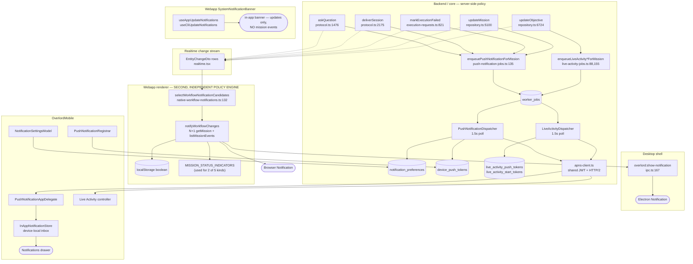
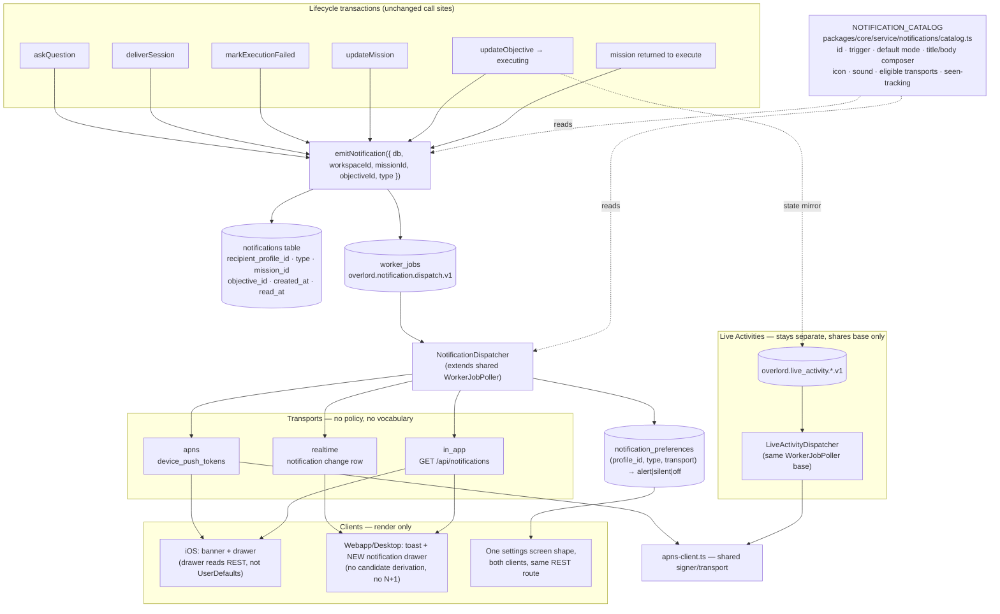

# Notification System Architecture Review (coo:637)

Status: review + target architecture. No code changed by this objective.
Scope: `Overlord` (backend, core, webapp, desktop, database, contract) and
`OverlordMobile` (iOS app).

---

## 1. Executive summary

There is no single notification system. There are **two independent ones** that
were built for different clients at different times, plus a third
(Live Activities) that shares plumbing with one of them but nothing else:

| | System A — server push | System B — client toasts | System C — Live Activities |
| --- | --- | --- | --- |
| Decides *what* is notifiable | Backend, in the mutating transaction | Webapp renderer, from the realtime change stream | Backend, in the mutating transaction |
| Event vocabulary | `PUSH_NOTIFICATION_CATEGORIES` (4) | `WorkflowNotificationKind` (5) | n/a — state mirror, not events |
| Reaches | iOS only | Open browser/desktop tabs only | iOS Lock Screen only |
| Preferences | `notification_preferences` table, per category | one localStorage boolean | none |
| History | mobile `InAppNotificationStore` (device-local) | none | n/a |
| In the contract? | Yes, in detail | **No — absent entirely** | Yes |

The two event vocabularies describe **six real-world moments** between them, and
only *one* of those six is modelled the same way on both sides. Which surface a
user gets notified on today is an artifact of which system happened to implement
that event, not a product decision.

The consolidation target is stated at the end (§5): **one catalog, one
server-side emit point, one durable notification row, several dumb transports.**
Adding a notification type should be one catalog entry plus one `emit` call.

---

## 2. What exists today

### 2.1 Trigger sites — where "this is notifiable" is decided

Five places, in two different tiers:

| # | Location | Emits | Tier |
| --- | --- | --- | --- |
| 1 | `packages/core/service/protocol.ts:1476` (`askQuestion`) | `agent_question` | server |
| 2 | `packages/core/service/protocol.ts:2175` (`deliverSession`) | `mission_awaiting_review` | server |
| 3 | `packages/core/service/execution-requests.ts:821` (`markExecutionFailed`) | `mission_failed` | server |
| 4 | `backend/repository.ts:5100` (`updateMission`) | `mission_complete` | server |
| 5 | `webapp/web/lib/native-workflow-notifications.ts:132` (`selectWorkflowNotificationCandidates`) | `agent_started`, `ready_for_review`, `blocking_question`, `returned_to_execute`, `launch_failed` | **client** |

Sites 1–4 write a durable `worker_jobs` row inside the same transaction as the
domain mutation. Site 5 re-derives notifications in the browser by pattern-matching
`EntityChangeDto` rows off the SSE stream — a parallel, non-durable, tab-scoped
reimplementation of the same policy.

### 2.2 Delivery paths

```
APNs alert          device_push_tokens          backend/push-notification-dispatcher.ts
APNs background     device_push_tokens          same dispatcher, mode='silent'
APNs liveactivity   live_activity_push_tokens   backend/live-activity-dispatcher.ts
APNs push-to-start  live_activity_start_tokens  same dispatcher, start job
Electron toast      —                           desktop/src/ipc.ts:167 via preload.ts:132
Browser toast       —                           new Notification() in the renderer
```

Three non-interchangeable APNs credential families, two in-process dispatchers,
one shared signer (`backend/apns-client.ts`).

### 2.3 In-app surfaces (three, unrelated to each other)

- **Mobile drawer** — `OverlordMobile/Overlord/Lib/InAppNotificationStore.swift`.
  Device-local `UserDefaults` inbox reconstructed from APNs payloads and
  `UNUserNotificationCenter.deliveredNotifications()`, because *there is no REST
  history surface for notifications*.
- **Webapp `SystemNotificationBanner`** — `webapp/web/components/system-notifications/`.
  Despite the name, this never shows mission notifications; its only producers
  are app-update and CLI-update status (`useAppUpdateNotifications`,
  `useCliUpdateNotifications`). Mission toasts bypass it entirely and go straight
  to the OS.
- **Mission card corner dots** — `mission_status_seen` + `MISSION_STATUS_INDICATORS`
  (`webapp/web/lib/mission-status-catalog.ts`). Ambient, seen-tracked, server-derived.

### 2.4 Preference stores (two, never synchronised)

- `notification_preferences` (profile-scoped, `(profile_id, category)` unique,
  `alert | silent | off`, plus reserved `all` master row) —
  `backend/push-notifications.ts:134` and `GET/PUT /api/profile/notification-preferences`.
  **Only the iOS app reads or writes it.**
- `localStorage['overlord-native-notifications-enabled']` —
  `webapp/web/lib/native-notification-preferences.ts`. A single boolean, scoped to
  one browser profile or one desktop install. **Only the webapp reads it.**

Turning "Ready for review" off on the phone has no effect on the desktop toast,
and the desktop switch has no effect on the phone.

### 2.5 Architecture — current state



The two vertical stacks (`SRV → APNS → IOS` and `SSE → WEB → DESK`) never meet.
Every box in `WEB` is a re-implementation of something in `SRV`.

---

## 3. Duplication and unnecessary complexity

Ordered by cost to fix vs. value.

### D1 — Two event vocabularies for the same six events *(highest impact)*

| Real event | Server category | Webapp kind | Status catalog | Reaches |
| --- | --- | --- | --- | --- |
| Agent blocked / asked a question | `agent_question` | `blocking_question` | `blocking_question` | phone + desktop |
| Objective delivered, review owed | `mission_awaiting_review` | `ready_for_review` | — | phone + desktop |
| Execution / launch failed | `mission_failed` | `launch_failed` | — | phone + desktop |
| Mission closed | `mission_complete` | — | — | **phone only** |
| Agent started executing | — | `agent_started` | — | **desktop only** |
| Mission returned to execute | — | `returned_to_execute` | `returned_to_execute` | **desktop only** |

Three of six events reach only one client, and not by design. Adding a seventh
event today means touching a category constant, a DB `CHECK` constraint, a verb
map, a candidate selector, an event matcher, a status catalog, two Swift enums,
and a settings screen — in two repos.

### D2 — Notification policy runs client-side at all

`native-workflow-notifications.ts` re-derives lifecycle meaning from raw
`EntityChangeDto` rows. Consequences:

- **No open tab, no notification.** Closing the laptop lid silences desktop
  notifications entirely; nothing is queued and nothing is replayed.
- **No history.** There is no equivalent of the mobile drawer on desktop; a missed
  toast is gone.
- **Dedupe is in-memory** — `notifiedKeys` (`:31`) is a module-level `Set`, never
  pruned (unbounded growth in a long-lived tab) and lost on reload (a refresh can
  re-fire an already-shown toast).
- **N+1 fetching.** `notifyWorkflowChanges` (`:256`) issues `getMission` +
  `listMissionEvents` for every mission in every change batch, *before* dedupe,
  including for candidates that will be discarded. `selectWorkflowNotificationCandidates`
  speculatively pushes both `blocking_question` and `ready_for_review` for every
  `mission_event` insert (`:167`), so ordinary progress events drive two REST
  round-trips per mission per SSE tick.

### D3 — Two preference systems, one of which is not a preference system

Per-category, per-account, server-authoritative preferences exist (§2.4) and are
correct. The webapp ignores them for a single device-local on/off boolean. Users
have no way to say "questions yes, mission-complete no" anywhere except iOS.

### D4 — Three copies of the worker-job enqueue pattern

`enqueuePushNotificationJob` (`push-notification-jobs.ts:79`),
`enqueueLiveActivityDispatchJob` (`live-activity-jobs.ts:29`) and
`enqueueLiveActivityStartJob` (`live-activity-jobs.ts:109`) are structurally
identical: a dialect-aware JSON predicate helper (`dedupePredicate` /
`profilePredicate` — same function, two names), the same
`SELECT id FROM worker_jobs WHERE workspace_id = ? AND type = ? AND status IN ('queued','running') … LIMIT 1`,
then the same INSERT with hardcoded `priority 40, max_attempts 5`.

A fourth, better variant with configurable priority and attempts already exists:
`enqueueDeliveryComposeJob` (`packages/core/service/worker-jobs.ts:127`). That is
the one that should have been generalised.

### D5 — Two dispatcher classes with the same skeleton

`PushNotificationDispatcher` (`push-notification-dispatcher.ts:133`) and
`LiveActivityDispatcher` (`live-activity-dispatcher.ts:143`) both hand-roll: a
1500 ms `setInterval`, a `polling` re-entrancy flag, a `workerId` string,
claim → process → finish/retry, retire-token-on-`isRetiredTokenResponse`, and
`console.error` on poll failure. The retry branch exists twice — extracted as
`failOrRetry` in one (`live-activity-dispatcher.ts:324`) and inlined in the other
(`push-notification-dispatcher.ts:221`).

Note the LA dispatcher's update path uses a raw `status === 400 || 410` check
(`:218`) instead of the shared `isRetiredTokenResponse` used everywhere else —
a divergence that only exists because the loop was copied rather than shared.

### D6 — Identical mission-owner resolution, written twice

`missionOwnerProfileId` (`live-activity-jobs.ts:67`) and the inline query in
`enqueuePushNotificationForMission` (`push-notification-jobs.ts:150`) are the
same SQL, character for character. Both encode the same product rule
("assignment is the addressing rule for every push surface"), so it should be one
function.

### D7 — Presentation strings scattered across four modules

- `CATEGORY_VERBS` + `buildPushNotificationPresentation` (`push-notifications.ts:36,264`)
- inline literals in `notifyWorkflowChanges` — `'Agent started'`, `'Ready for review'`, `'Launch failed'`
- `MISSION_STATUS_INDICATORS[].notification.title` (`mission-status-catalog.ts:65`)
- Swift: `NotificationCategory.label/detail` (`NotificationSettingsModel.swift:118`) and
  `.drawerLabel/.systemImage` (`InAppNotificationStore.swift:238`)

The status catalog's own docstring claims to be "the single source of truth for
… native-notification profile", but only 2 of the 5 webapp kinds actually read
it; the other three hardcode their titles. The generalisation was started and not
finished.

### D8 — Four dedupe mechanisms

Enqueue-time `dedupeKey` scan → APNs `apns-collapse-id` (`category:missionId`) →
mobile store coalescing id (`category:missionId`) → renderer `notifiedKeys` +
browser `tag`. Three agree on the key shape by convention only; nothing enforces it.

### D9 — Two definitions of "the badge number"

The server sends `aps.badge` = the assignee's missions-in-review count
(`push-notifications.ts:286`). The app throws that away and sets the icon badge
to the local unread-drawer count (`InAppNotificationStore.swift:212`). Both are
defensible; having both is not. It also means the badge is only correct while the
app is running, since only the app can compute the local number.

### D10 — Contract gap

`contract/components.yaml` documents the APNs/mobile surface thoroughly (lines
47, 49, 189, 284–285, 330–341) and says **nothing** about the desktop/web
notification pipeline — `window.overlord.showNotification`, the IPC channel, the
localStorage preference, or the client-side policy engine. The larger of the two
notification systems by user reach is entirely outside the contract.

### D11 — Naming collisions that mislead

- `SystemNotification*` in the webapp means "in-app update banner", not notifications.
- `backend/execution/runner-queue-notify.ts` is Postgres `LISTEN/NOTIFY` for
  runner long-polls — unrelated to user notifications, but matches every grep.

Any consolidation should rename `system-notifications/` to something like
`app-banners/` and reserve "notification" for the user-facing concept.

---

## 4. What is *not* a problem

Worth stating so consolidation does not overreach:

- **Keeping ActivityKit tokens separate from device tokens is correct** and must
  survive. They have different lifetimes, topics, push types, and permission
  models; mixing them fails closed at APNs at best and silences a user's alerts
  at worst. `CONTRACT.md` version 55 and `apns-client.ts` are right about this.
- **Live Activities are not an event channel.** They mirror ongoing state, are
  coalesced by profile rather than by event, and must not be folded into the
  event notification system. They should share the *job/dispatcher base class*
  and the APNs signer, nothing above that.
- **Recomputing presentation at delivery time from ids** (`buildPushNotificationPresentation`)
  is a good decision — payload minimisation plus correct-at-delivery semantics.
  Keep it, and extend it to the new transports.
- **Fixed per-category verbs never derived from user text** is a deliberate
  injection guard. Keep it.

---

## 5. Target architecture

One catalog. One server-side emit point. One durable row. Dumb transports.



### 5.1 The catalog entry — the whole point of the exercise

```ts
// packages/core/service/notifications/catalog.ts
export const NOTIFICATION_CATALOG = {
  agent_question: {
    id: 'agent_question',
    label: 'Agent questions',
    detail: 'An agent is blocked and asked a question.',
    verb: 'needs your input',
    defaultMode: 'alert',
    transports: ['apns', 'realtime', 'in_app'],
    icon: 'questionmark.bubble.fill',
    dotClassName: 'bg-orange-500',
    soundUrl: null,
    seenTracked: true
  },
  // …one entry per type
} as const satisfies Record<NotificationType, NotificationDescriptor>;
```

This one module replaces `PUSH_NOTIFICATION_CATEGORIES`, `CATEGORY_VERBS`,
`WorkflowNotificationKind`, `MISSION_STATUS_INDICATORS.notification`, and the two
Swift presentation extensions (the app fetches descriptors from the server or
generates the enum from the catalog).

**Adding a notification type becomes:** one catalog entry, one `emitNotification`
call at the trigger site, one migration line if the `CHECK` constraint is kept.
No client change, no dispatcher change, no settings-screen change.

### 5.2 Phased migration

Each phase is independently shippable and leaves the system working.

| Phase | Work | Effort | Removes |
| --- | --- | --- | --- |
| **P0 — Plumbing dedupe** (no behaviour change) | Extract `enqueueWorkerJob({type, dedupeBy, payload, priority, maxAttempts})` and a `WorkerJobPoller` base from the two dispatchers; hoist `missionOwnerProfileId` into one shared function; make the LA update path use `isRetiredTokenResponse`. | S | D4, D5, D6 |
| **P1 — The catalog** | Add `packages/core/service/notifications/catalog.ts` covering all six events. Point the existing server categories *and* `MISSION_STATUS_INDICATORS` at it. Client toasts keep working, but read every title from the catalog. | S–M | D1 (partly), D7 |
| **P2 — Durable notifications + realtime transport** | Add the `notifications` table, `emitNotification`, `overlord.notification.dispatch.v1`, `GET /api/notifications` + read/dismiss routes, and a `notification` entity in the realtime change stream. Add the two missing server emits (`agent_started`, `returned_to_execute`). | M–L | D2 (server half) |
| **P3 — Webapp switches to consuming** | Delete `selectWorkflowNotificationCandidates` / `notifyWorkflowChanges`. The renderer subscribes to notification rows and calls `showNotification`. Add a webapp notification drawer over `GET /api/notifications`. Rename `system-notifications/` → `app-banners/`. | M | D2, D8, D11 |
| **P4 — One preference store** | Migrate `notification_preferences` to `(profile_id, type, transport)`. Webapp settings page moves off localStorage onto the REST route (keeping an additive per-device mute if wanted). | M | D3 |
| **P5 — Mobile drawer reads REST** | `InAppNotificationStore` becomes a cache over `GET /api/notifications` instead of reconstructing from `deliveredNotifications()`. Settle the badge on one definition. | M | D9 |

P0+P1 alone remove most of the copy-paste and give a single vocabulary while the
delivery topology is untouched — worth doing even if P2–P5 are deferred.

### 5.3 Contract impact

Proposed `contract/components.yaml` / `CONTRACT.md` deltas, with per-module impact:

| Change | Impacted modules |
| --- | --- |
| **Add** the webapp/desktop native-notification pipeline to the contract (currently undocumented — D10): `window.overlord.showNotification` bridge, the `overlord:show-notification` IPC channel, and the fact that policy is server-owned after P3. | `webapp`, `desktop` — documentation of existing behaviour; no code impact at P0. |
| **Add** private core table `notifications` and job type `overlord.notification.dispatch.v1` to the core-service capability list (line 47/49 neighbourhood). | `database` (migration, both dialects), `packages/core`, `backend`. |
| **Generalise** the notification-preferences invariant (line 341) from four fixed categories to "types are exactly those in the shared notification catalog, addressed per (type, transport)". | `backend` (validation), `webapp` (new settings UI), `OverlordMobile` (settings model tolerates unknown types already — `NotificationSettingsModel.swift:100`), `database` (CHECK constraint or reference table). |
| **Add** authenticated `GET /api/notifications` + read/dismiss routes and the `notification` realtime entity type. | `backend`, `webapp`, `OverlordMobile`, `contract` route families. |
| **Preserve unchanged**: the three-credential-family separation, assignment-as-addressing, payload minimisation, and the rule that the master switch never affects Live Activity delivery. | none — these constraints carry forward verbatim. |

No contract change is required for P0 (pure internal refactor).

### 5.4 Risks

- **P2/P3 changes who owns notification policy.** Between the server emit landing
  and the client derivation being deleted, both would fire — the phases must ship
  in order, and P3 must delete the client path in the same release that P2's
  realtime transport goes live, or users get doubled toasts.
- **Preference migration (P4) must default-open.** Widening
  `(profile_id, category)` to `(profile_id, type, transport)` needs every existing
  row to fan out to all transports for that type, or users silently lose alerts
  they had enabled.
- **Mobile is a separate release train.** P5 requires an App Store build; the REST
  history surface must be additive so older builds keep working off the
  `deliveredNotifications()` path.
- **`agent_started` becoming a server notification will increase volume** on iOS,
  where it previously did not exist. It should ship defaulting to `silent` (or
  `off`) rather than `alert`.

---

## 6. Suggested follow-up objectives

1. **P0 — Extract shared worker-job enqueue + dispatcher base** (`backend`, `packages/core`). Pure refactor, no contract change.
2. **P1 — Build the shared notification catalog** and repoint the server categories and the webapp status catalog at it.
3. **P2 — Durable `notifications` table, `emitNotification`, dispatch job, REST + realtime transport**, plus the two missing server-side emits.
4. **P3 — Delete the client-side policy engine**; webapp consumes notification rows and gains a drawer; rename `system-notifications/` → `app-banners/`.
5. **P4 — Unify preferences** on `(profile_id, type, transport)` and move webapp settings off localStorage.
6. **P5 — Mobile drawer over REST**, single badge definition.
